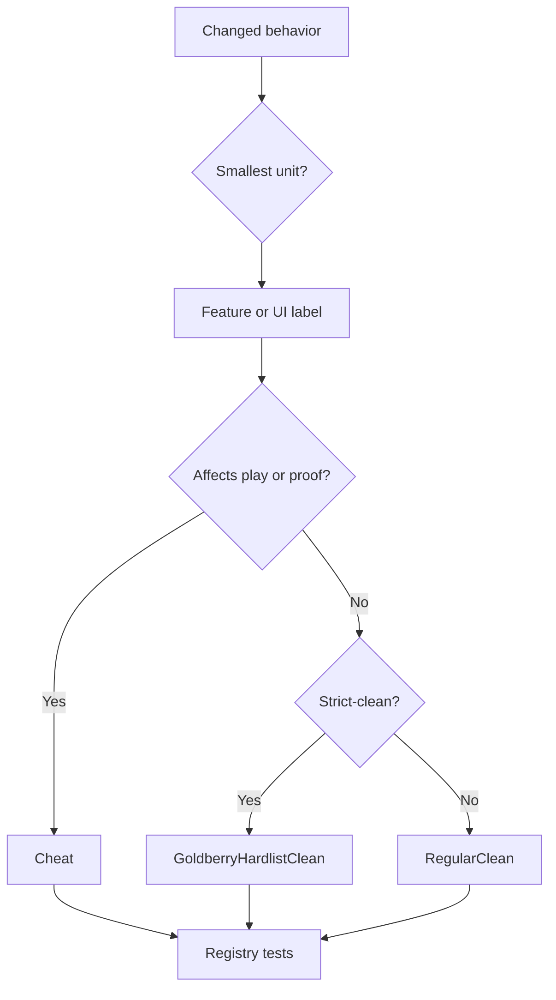

Akron feature policy classifies behavior based on its impact on gameplay, proof assumptions, hidden information, and state. The single source of truth is `Source/Core/AkronFeatureRegistry.cs`.

## Status Categories

| Status | Color | Meaning |
|---|---:|---|
| `GoldberryHardlistClean` | Blue `#248bff` | Full clean for strict Goldberry and Hardlist/Hard Clears contexts. |
| `RegularClean` | Green `#00ff00` | Normal clear for ordinary play, but not necessarily approved for strict clean submissions. |
| `Cheat` | Red `#ff0000` | Changes gameplay, exposes hidden information, changes proof assumptions, or manipulates state. |

Do not introduce new policy words. Akron does not use Yellow, Practice, or a separate room-lab clear category.

`AkronStatus` order matters because attempt status escalates by enum value:

```csharp
GoldberryHardlistClean = 0
RegularClean = 1
Cheat = 2
```

## Classification Flow



## Suboptions

Classify the smallest meaningful behavior. A parent row can be clean while a tooltip suboption is Cheat.

Examples:

- Safe Mode can be clean while stat-freeze suboptions are Cheat.
- Room or map capture can be clean while a timer-freeze suboption is Cheat.
- Input history can be Goldberry/Hardlist clear while extra history review options are Normal clear.

Implementation rules:

1. If the row maps to an `AkronFeatureKind`, classify it in `Definitions`.
2. If the row has no `AkronFeatureKind`, add it to `UiLabelClassifications`.
3. If a tooltip suboption differs from the parent, add it to `UiSuboptionClassifications`.
4. Add or update tests in `tests/feature-registry-tests.cs`.

## Feature Shape

Pick the row type based on how the user interacts with it.

| Shape | Use for | UI rule | Policy rule |
|---|---|---|---|
| Toggle | Ongoing enabled/disabled behavior. | Main row toggles only the enabled state. Configuration goes in the tooltip. | Classify the enabled behavior. |
| Button | One-shot action. | Render as an action button, not a toggle. | Classify the action itself. |
| Numeric toggle | Feature with an enabled state and value. | The row toggles active/inactive. The tooltip changes the value. | Off means vanilla behavior; on uses the configured value. |
| Radio/dropdown | Mutually exclusive mode. | Changing the mode must not auto-enable the parent feature. | Classify any mode that changes policy separately if needed. |
| Checkbox list | Independent suboptions inside a tooltip. | Each checkbox changes only that suboption. | Escalate suboptions that are stricter than the parent. |
| Read-only label | Status display or keybind overview. | Do not make it look editable. | Classify the displayed information. |

Configuration values should not activate a feature by themselves. For example, if a sound override volume is set to `150` but the per-sound modifier is off, the live game should use vanilla sound volume.

## Classification Examples

| Behavior | Default status | Why |
|---|---|---|
| Input display with no frame counts or history advantage | `GoldberryHardlistClean` | Displays local inputs without changing gameplay. |
| Screenshake reduction | `GoldberryHardlistClean` | Accessibility comfort with no gameplay state change. |
| Recording, screenshots, and proof output | `GoldberryHardlistClean` | Proof workflow only. |
| Death or attempt counters | `GoldberryHardlistClean` | Allowed when unobtrusive and not used as hidden run-state advice. |
| Room names, status labels, and custom labels | `RegularClean` | Clean overlay information, but not strict-submission approved by default. |
| Audio routing, volume, pitch, or playback-speed presentation | `RegularClean` | Presentation/accessibility change that can affect verification context. |
| Visual noise reduction, trails, tint, and lighting | `RegularClean` | Visual changes are case-by-case for strict submissions. |
| Import/export of settings | `RegularClean` | Configuration workflow, unless it enables Cheat behavior during a run. |
| StartPos, warps, and reload room | `Cheat` | State or position manipulation. |
| Live hitboxes, triggers, trajectory, entity flags, and session flags | `Cheat` | Hidden information during an active attempt. |
| Stamina, dash count, exact speed, and resource HUDs | `Cheat` | Info-mod behavior. |
| Noclip, invincibility, infinite resources, and variants | `Cheat` | Gameplay mutation. |
| Pause/frame stepping, timescale, TPS bypass, and FPS bypass | `Cheat` | Simulation timing or proof assumptions change. |
| Camera offset, cursor zoom, and free camera | `Cheat` | Camera tools can reveal or emphasize information not normally available. |
| Input shortcuts such as Neutral Drop or Backboost | `Cheat` | Synthesizes or changes execution inputs. |
| Respawn time, death visuals, and respawn animation | `RegularClean` | Post-death pacing and presentation do not affect live gameplay. |
| Grab mode hotkey | `RegularClean` | Changes a player control preference without synthesizing inputs or mutating physics. |

## Enforcement

Policy is enforced through:

- `Source/Core/AkronFeatureRegistry.cs` for classifications and reasons.
- UI label and suboption classification maps.
- Runtime calls that use `TryUse` or `CanUse`.
- Feature registry tests.
- [Clean vs cheat classifications](/concepts/clean-vs-cheat).

## Writing Policy Reasons

Good reasons say what behavior affects policy:

- `Displays local inputs without changing gameplay.`
- `Changes simulation cadence and gameplay timing.`
- `Draws hidden trigger volumes for map inspection.`

Avoid marketing text, vague value claims, or reasons tied to a specific UI layout.

## Tooltip Writing

Tooltips should describe what the feature does. They should not justify why a player might use it.

Good tooltip style:

- Say what changes when the option is enabled.
- Mention the affected state: gameplay, camera, proof, timer, save, audio, overlay, recording, or import/export.
- Keep it concrete and short.
- For dangerous options, name the risk plainly.
- Do not repeat policy badge text manually. The UI owns policy display.
- Do not say a feature is "for practice", "for cheating", or "safe" as the main explanation.
- Do not imply configuration is active when the parent toggle is off.

Examples:

| Avoid | Prefer |
|---|---|
| Enhances input history. | Show a rolling list of recent input chords and held-frame counts. |
| Useful safety feature. | Restore the current save slot's death counter while Safe Mode is active. |
| Better camera. | Pause the whole level while free camera is active. Madeline is not player-controlled either way. |
| Configure visuals. | Text color for option feedback messages. |

Prefer concrete verbs such as show, hide, dim, mute, route, export, import, record, set, clear, save, load, reset, apply, reduce, skip, clamp, cache, and filter.

## Feature Registry Checklist

When adding or changing a policy-visible feature:

1. Decide the smallest behavior unit that needs policy tracking.
2. Add an `AkronFeatureKind` only if the behavior is a real policy unit reused by code or attempt tracking.
3. Add a `FeatureDefinition` with `GoldberryHardlistClean`, `RegularClean`, or `Cheat`.
4. Write the reason as a policy explanation, not a tooltip.
5. If the UI row lacks `FeatureKind`, add `UiLabelClassifications` coverage.
6. If a popup suboption differs from the parent, add `UiSuboptionClassifications` coverage.
7. Add or update rows in `tests/feature-registry-tests.cs`.
8. Run `dotnet test tests/akron-tests.csproj --nologo --filter FeatureRegistryTests`.

Before committing a policy change, check that:

- No `AkronStatus.Practice`, `QolSafe`, `CleanCaution`, or Yellow category text was reintroduced.
- Every `AkronFeatureKind` has a `FeatureDefinition`.
- Every new row or suboption displays an accurate classification.
- Tooltip copy describes behavior and leaves classification formatting to the UI.
- The registry, tests, feature guide, and classification docs agree on the policy rule.
