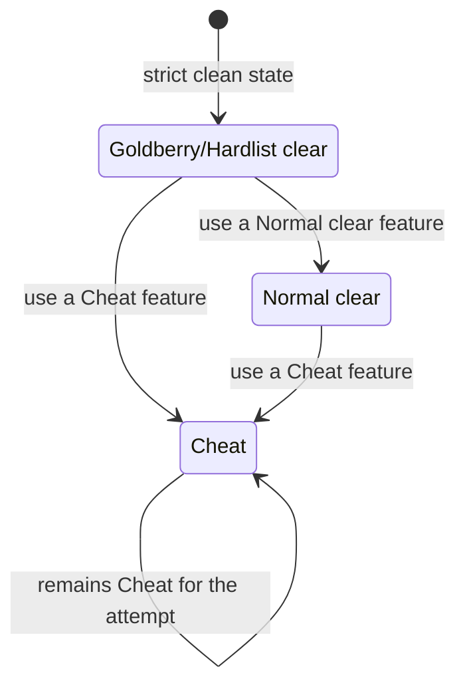

Follow this tutorial after installing Akron. Open the overlay, confirm Akron is active, and verify the status shown during play.

<Steps>
  <Step title="Launch Celeste">
    Start Celeste through Everest with Akron enabled.
  </Step>
  <Step title="Open Akron">
    Press `Tab`, the default overlay bind. If this bind was changed or conflicts with another mod, configure it in Everest's mod options.
  </Step>
  <Step title="Check the current setup">
    Look at the overlay status area for the current setup and attempt status. Fresh installs should show Akron's default setup unless you changed Akron's Everest mod options or imported a setup pack.
  </Step>
  <Step title="Check the status chip">
    Akron shows the current attempt status: Goldberry/Hardlist clear, Normal clear, or Cheat. The status can escalate during an attempt, but it does not silently downgrade.
  </Step>
  <Step title="Try a harmless surface">
    Open a read-only HUD or label option, such as room labels, then close the overlay and verify that normal gameplay continues.
  </Step>
</Steps>

## First Setup

Use the default setup if you are exploring Akron for the first time. It keeps the normal overlay workflow available without putting the session into a proof-oriented workflow.

Use the overlay to enable only the tools you need. StartPos restore, warps, frame tools, timescale, and other state-changing tools — each use is a deliberate action that can change the active attempt status.

Advanced policy presets such as `Practice`, `Sandbox`, and `Leaderboard-clean` live in Akron's Everest mod options, commands, and setup imports. They are not the main first-run overlay workflow.

## What The Status Means

The status is monotonic for the active attempt. Once a feature escalates the attempt, disabling the feature afterward does not revert the status to its previous level.

## Next Steps

- Configure core behavior in [Configuration](/getting-started/configuration).
- Set or recover binds in [Hotkeys](/getting-started/hotkeys).
- Learn the overlay in [Overlay](/player-guide/overlay).
- Read [Rulesets and status](/concepts/rulesets-and-status) before relying on Akron during submitted runs.
