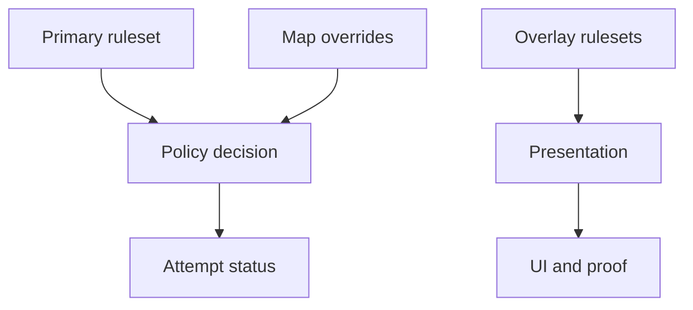

Rulesets define Akron's policy environment. They decide whether feature use is allowed, blocked, recorded, or presented differently.

This is an explanation page. For step-by-step configuration, see the Everest mod options screen or the `akron_ruleset` command. Player-oriented guides should start with the Akron overlay, visible attempt status, and setup packs.

## Built-in primary rulesets

Primary rulesets are the base policy for a session. They determine the default "legitimacy" of the attempt and which tools are permitted.

| Ruleset | Purpose |
|---|---|
| `Casual` | QoL-first mode. State-changing features stay opt-in. |
| `Practice` | Room-lab defaults for StartPos setup, route review, HUD timing, input display, and death stats. |
| `Leaderboard-clean` | Blocks state-changing features. Akron shows explicit conflict prompts instead of auto-switching. |
| `Sandbox` | Removes Akron policy blocks. Does not auto-enable features for you. |
| `Everest-safe` | Conservative on unknown Everest content. Pushes risky compatibility decisions behind explicit overrides. |
| `Map-maker` | Favors inspection, reload, and debug traversal without automatically turning on overt gameplay cheats. |

## Overlay rulesets

Overlay rulesets are presentation or proof layers that sit on top of the primary ruleset. They do not change what is *allowed*, but change how it is *shown* or *recorded*.

| Overlay state | Purpose |
|---|---|
| `Streamer Mode` | Hides local filesystem paths by showing only filenames. |
| `Proof Mode` | Keeps proof surfaces compact and ruleset-aware. Normally enabled indirectly by Submission Mode or imported/community rulesets. |
| `Low-distraction` | A derived state active when all visual-noise channels are disabled (particles, trails, glitch, anxiety, distortion). |

## Ruleset stack

Primary rulesets control allowed behavior. Overlay states change presentation or proof output. Map compatibility overrides can affect risky runtime paths, such as StartPos restore, to avoid corruption in specific map versions.

## Reading a ruleset

When evaluating a feature's behavior, consider the following:

1. **Permission:** Is the feature allowed in the current primary ruleset?
2. **Recording:** If allowed, what status (e.g., `RegularClean`, `Cheat`) does its use record?
3. **Specificity:** Does a sub-option have stricter behavior?
4. **Overrides:** Does a map compatibility override change the runtime path?
5. **Presentation:** Does an overlay state hide paths or add proof output?

See [Clean vs cheat classifications](/concepts/clean-vs-cheat) for the classification model and [Feature guide](/feature-guide) for current row behavior.
