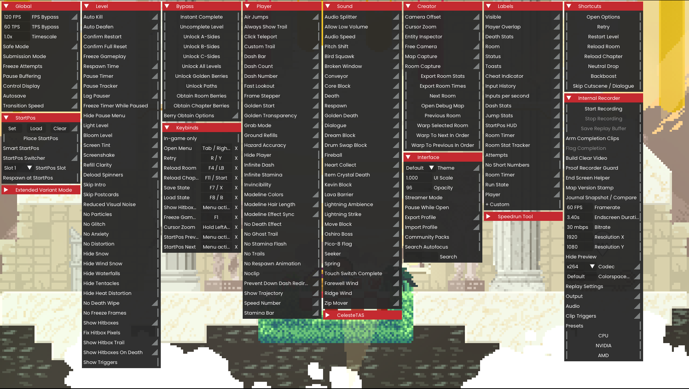
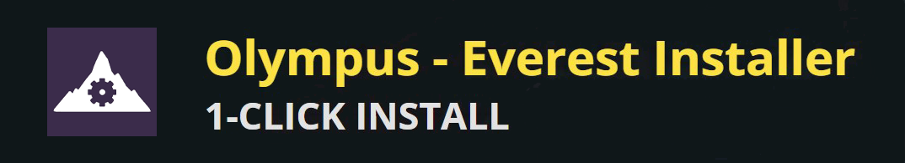

<p align="center">
  
</p>

<p align="center">
  <a href="https://gamebanana.com/mods/681169"></a>
  <a href="https://gamebanana.com/mods/681169"></a>
  <a href="https://github.com/Microck/akron/actions/workflows/ci.yml"></a>
  <a href="LICENSE"></a>
</p>



## what is Akron?

Akron is a player-facing utility suite for Celeste that runs inside Everest. it centers on an in-game overlay for practice, routing, hud visibility, capture, setup sharing, and visible attempt status.

the overlay keeps common player tools close to the game instead of scattered across separate menus. players can check the current setup, adjust practice or hud surfaces, capture play, and move back into the level without changing context.

[documentation](https://akron.micr.dev/docs) | [gamebanana](https://gamebanana.com/mods/681169)

## quickstart

<p>
  <a href="everest:https://gamebanana.com/mmdl/1718351,Mod,681169">
    
  </a>
  <a href="https://gamebanana.com/dl/1718351">
    
  </a>
</p>

1. install Akron with Olympus, or download it from [gamebanana](https://gamebanana.com/mods/681169) and place the downloaded mod archive in your Everest `Mods` folder. do not unzip manual installs unless a release explicitly says to.
2. launch Celeste through Everest.
3. press `Tab` to open Akron.

## what does it include?

### overlay and hud

the tabbed in-game overlay includes hud widgets for labels, inputs, timers, resources, stats, and setup state. it is the main surface for checking and changing options while staying inside Celeste.

### practice and routing

startpos tools, retry and reload helpers, frame and timescale controls, and room-lab utilities are grouped around setup, routing, and quickly returning to the part of a map that needs practice.

### status and policy

status chips and policy badges make feature use visible. they do not prove a run or replace community submission rules, but they keep Akron's current setup from being ambiguous.

### .akr setup packs

`.akr` setup packs save, import, and share scoped Akron setups. they are used for personal setups and community packs for map-specific configurations.

### capture tools

screenshots and internal recording support sharing or reviewing play.

see the [feature guide](https://akron.micr.dev/docs/feature-guide) for the full detailed list.

## external integrations

some overlay rows appear only when certain external mods are installed or configured. Akron does not depend on, bundle, or replace those tools but instead provides a visual gui for ease of use:

- **[Motion Smoothing](https://gamebanana.com/mods/514173):** controls for motion smoothing's fps/tps bypass settings and related smoothing options.
- **[Speedrun Tool](https://gamebanana.com/tools/6597):** status, save-state slots, capture/restore/clear actions, and room timer export when the tool is loaded.
- **[CelesteTAS](https://gamebanana.com/tools/6715):** tas status, the configured tas file, and launching that configured tas handoff.
- **[Extended Variant Mode](https://gamebanana.com/mods/53650):** available variant options exposed by the mod.

see the [compatibility](https://akron.micr.dev/docs/troubleshooting/compatibility) and [external integrations](https://akron.micr.dev/docs/feature-guide/external-tools) docs for details.

## contributing

Akron is a .NET Everest mod. for local development:

```bash
dotnet format Akron.sln --include Source/Core/AkronFeatureRegistry.cs tests/feature-registry-tests.cs
dotnet build Source/Akron.csproj
dotnet test tests/akron-tests.csproj --nologo
```

read the [contributor docs](https://akron.micr.dev/docs/contributing/development-setup) before changing feature policy, rulesets, setup packs, or public behavior.

## support

if Akron helps with your Celeste practice, routing, captures, or setup sharing, optional support is available on [ko-fi](https://ko-fi.com/microck). no features are or will be locked behind donations or a paywall.

<p align="left">
  <a href="https://ko-fi.com/microck">
    
  </a>
</p>

## license

Akron is licensed under the [MIT license](LICENSE).
