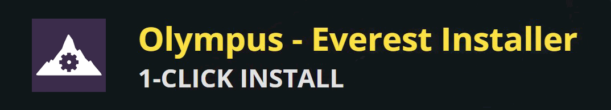

<p align="center">
  
</p>

<p align="center">
  <a href="https://gamebanana.com/mods/681169"></a>
  <a href="https://gamebanana.com/mods/681169"></a>
  <a href="https://github.com/Microck/akron/actions/workflows/ci.yml"></a>
  <a href="LICENSE"></a>
</p>

## Akron

Akron is a player-facing utility suite for Celeste that runs inside Everest. Its in-game overlay provides practice, routing, HUD, capture, setup-sharing, and attempt-status tools.

The overlay keeps common tools beside the game. Players can check their setup, adjust practice and HUD tools, capture play, and return to the level.

[Documentation](https://akron.micr.dev/docs) | [GameBanana](https://gamebanana.com/mods/681169)

## Quickstart

[](https://akron.micr.dev/olympus)
[](https://akron.micr.dev/raw)

1. Install Akron with Olympus, or download it from [GameBanana](https://gamebanana.com/mods/681169) and place the downloaded mod archive in your Everest `Mods` folder. Do not unzip manual installs unless a release explicitly says to.
2. Launch Celeste through Everest.
3. Press `Tab` to open Akron.

## Included tools

### Overlay and HUD

The tabbed in-game overlay includes HUD widgets for labels, inputs, timers, resources, stats, and setup state. It is the main surface for checking and changing options while staying inside Celeste.

### Practice and routing

StartPos tools, retry and reload helpers, frame and timescale controls, and room-lab utilities are grouped around setup, routing, and quickly returning to the part of a map that needs practice.

### Status and policy

Policy badges show each row's classification. The attempt-status chip shows the strictest classification Akron recorded for the current attempt. Community submission rules remain the authority for run acceptance.

### .akr setup packs

`.akr` setup packs save, import, and share scoped Akron setups. They are used for personal setups and community packs for map-specific configurations.

### Capture tools

Screenshots and internal recording support sharing or reviewing play.

See the [feature guide](https://akron.micr.dev/docs/feature-guide) for the current option reference.

## External integrations

When a supported external mod is installed, Akron adds rows that control or report its features. Each tool remains a separate installation.

| Tool | Akron integration |
|---|---|
| [Motion Smoothing](https://gamebanana.com/mods/514173) | Controls for FPS/TPS bypass settings and related smoothing options. |
| [Speedrun Tool](https://gamebanana.com/tools/6597) | Status, savestate slots, capture/restore/clear actions, room timer export, and optional Lag Pauser handling for load-state hitches. |
| [CelesteTAS](https://gamebanana.com/tools/6715) | TAS status, the configured TAS file, and a playback handoff. |
| [Extended Variant Mode](https://gamebanana.com/mods/53650) | Available variant options exposed by the mod. |
| [Extended Camera Dynamics](https://gamebanana.com/mods/548940) | Camera hook status and Cursor Zoom zoom-out support when ECD camera hooks are active. |

See the [compatibility](https://akron.micr.dev/docs/troubleshooting/compatibility) and [external integrations](https://akron.micr.dev/docs/feature-guide/external-tools) docs for details.

## Contributing

Akron is a .NET Everest mod. For local development:

```bash
dotnet build Source/Akron.csproj
dotnet test tests/akron-tests.csproj --nologo
```

Read the [contributor docs](https://akron.micr.dev/docs/contributing/development-setup) for formatting and focused checks before changing feature policy, setup packs, or public behavior.

## Support

Optional support is available on [Ko-fi](https://ko-fi.com/microck). Donations help cover the domain, storage, and hosting. Akron's current features are free.

<p align="left">
  <a href="https://ko-fi.com/microck">
    
  </a>
</p>

## License

Akron-owned material is licensed under [Creative Commons Attribution-NonCommercial-NoDerivatives 4.0 International](LICENSE). Third-party components remain under the separate terms listed in [third-party notices](licenses/third-party-notices.txt).
