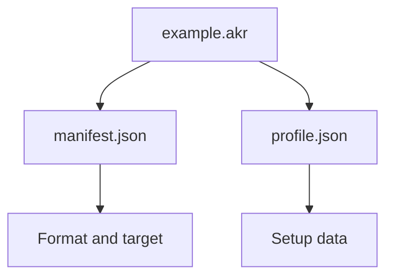

Akron setup state stores options, bindings, StartPos slots, and scoped tool settings for the current play context. `.akr` files are the shareable archive format Akron uses for setup packs and other structured data.

## Setup State

Use separate setup backups for different goals so state-changing tools do not bleed into clean-play or accessibility setups. For most players, the practical choice is the setup pack or overlay section they are importing, not a ruleset name.

The Akron overlay shows current policy/status state and tool state. It also supports `.akr` import/export for backing up or sharing the whole setup or a scoped section.

| Goal | Recommended setup |
|---|---|
| Explore Akron safely | Default setup |
| Use state-changing room-lab tools | Scoped room-lab setup |
| Keep clean-run guardrails visible | Clean-run setup |
| Experiment locally | Local testing setup |
| Inspect maps | Map inspection setup |
| Tune presentation and comfort | Accessibility or HUD setup |

## .akr Files

An `.akr` file is a strict ZIP archive with a manifest and one payload. Current setup packs use a `profile.json` payload, which is the archive entry name for profile data.

## Scoped Sections

Akron can export and import a whole setup or a focused section:

| Section | Use it for |
|---|---|
| `Whole` | Full setup state plus bindings and slots. |
| `StartPos` | Map or room StartPos snapshots. |
| `Keybinds` | Button bindings and Akron menu action bindings. |
| `Auto Kill` | Auto Kill trigger and area settings. |
| `Auto Deafen` | Auto Deafen trigger, hotkey, and area settings. |
| `Recorder` | Internal recorder, replay, audio, codec, and trigger settings. |
| `Audio` | Audio speed, pitch, per-sound volumes, and device settings. |
| `HUD` | HUD widgets, labels, input displays, resource bars, counters, and HUD presentation state. |

Scoped imports merge only the selected section into the current active settings. Unrelated settings are not affected.

## Sharing Guidance

- Export only the section needed by the recipient.
- Prefer scoped StartPos, Auto Kill, Auto Deafen, recorder, or audio packs over whole-setup packs for map-specific sharing.
- Keep a backup export before importing community packs.
- Treat imported attempt-changing options as policy-visible when used.

See [Import and export .akr packs](/akr-packs/import-export) for the workflow and [Akron .akr archives](/reference/akr-archives) for the reference contract.
