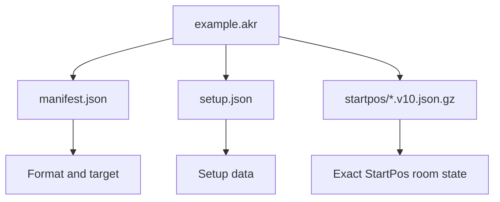

Akron setup state includes options, bindings, StartPos slots, and scoped tool settings. Akron also uses `.akr` archives for setup packs, overlay themes, HUD labels, and control-display presets.

## Setup state

Use separate setup packs for clean play, accessibility settings, map inspection, and state-changing room-lab tools.

The overlay shows the current attempt status and tool state. It can export the whole setup or one scoped section.

| Goal | Recommended setup |
|---|---|
| Explore Akron safely | Default setup |
| Use state-changing room-lab tools | Scoped room-lab setup |
| Keep clean-run guardrails visible | Clean-run setup |
| Experiment locally | Local testing setup |
| Inspect maps | Map inspection setup |
| Tune presentation and comfort | Accessibility or HUD setup |

## .akr files

An `.akr` file is a strict ZIP archive with a manifest and one main payload. Current setup packs use a `setup.json` payload. StartPos and Whole packs also contain one compressed v10 snapshot entry per saved StartPos.

```mermaid
flowchart TD
  archive["example.akr"] --> manifest["manifest.json"]
  archive --> payload["setup.json"]
  archive --> snapshots["startpos/*.v10.json.gz"]
  manifest --> target["Format and target"]
  payload --> settings["Setup data"]
  snapshots --> roomState["Exact StartPos room state"]
```

## Scoped sections

Akron can export and import a whole setup or a focused section:

| Section | Use it for |
|---|---|
| **Whole** | All portable setup state plus bindings and target-map StartPos slots. |
| **StartPos** | Map or room StartPos snapshots and settings. |
| **Keybinds** | Button bindings and Akron menu action bindings. |
| **Auto Kill** | Auto Kill trigger and area settings. |
| **Auto Deafen** | Auto Deafen toggle and area settings. The local hotkey is preserved. |
| **Recorder** | Portable replay-buffer, trigger, audio-capture, codec, quality, and preset settings. |
| **Audio** | Audio speed, pitch, and per-sound volumes and overrides. |
| **HUD** | HUD widgets, labels, input displays, resource bars, counters, and HUD presentation state. |

Scoped imports replace only the selected portable settings. StartPos imports
also replace every slot for the pack's target map while preserving slots for
other maps. Setup packs keep machine-local paths, device choices, recording
colorspace arguments, and the Auto Deafen hotkey unchanged.

Setup packs created before `akron-setup-v9` cannot be imported. Recreate the
setup and its StartPos slots in the current build, then export a new pack.

## Sharing guidance

- Export only the section needed by the recipient.
- Prefer scoped StartPos, Auto Kill, Auto Deafen, Recorder, or Audio packs over whole setup packs for map-specific sharing.
- Export the current setup before importing community packs.
- Treat imported attempt-changing options as policy-visible when used.

See [Import and export .akr packs](/akr-packs/import-export) for the workflow and [Akron .akr archives](/reference/akr-archives) for the reference contract.
