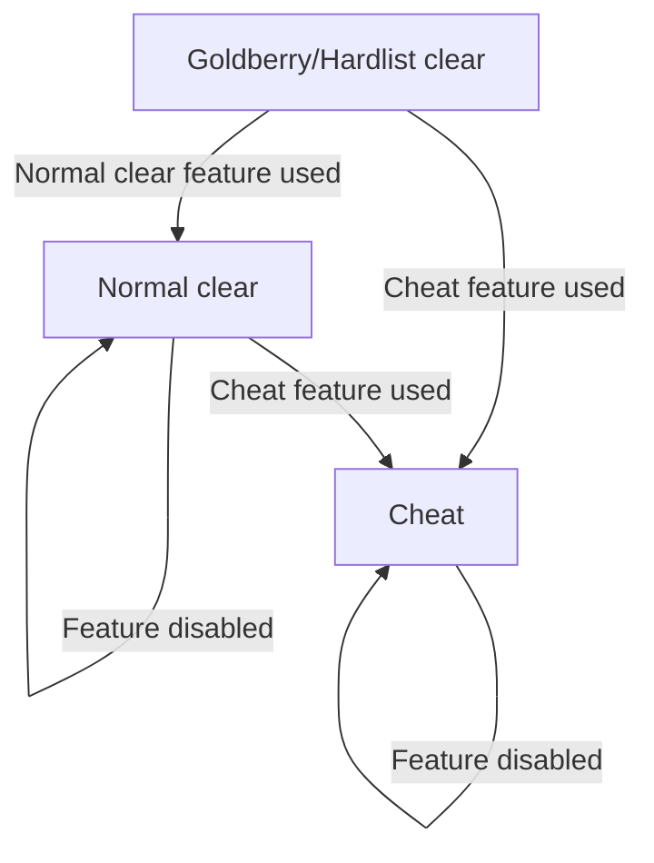

Akron classifies tools by what they do to an attempt, not by whether the tool is useful. A feature can be useful for practice, routing, accessibility, or proof work and still be marked Cheat when it changes gameplay, exposes hidden information, or weakens the evidence for a submitted clear.

Use this page when you want to understand why a feature has a policy badge. Use the [Feature guide](/feature-guide) when you need the current status for a specific overlay row.

## The three classes

| Class | Meaning | Typical examples |
|---|---|---|
| Goldberry/Hardlist clear | Akron treats the behavior as compatible with its strictest supported clean category. | Input display, proof capture helpers, simple confirmation prompts. |
| Normal clear | The behavior does not mutate gameplay, but it is not strict-approved by default. | Room labels, visual presentation, audio routing, custom labels, workflow helpers. |
| Cheat | The behavior changes gameplay, exposes hidden or exact internal state, manipulates run state, or changes proof assumptions. | StartPos restore, warps, hitboxes, noclip, infinite resources, timescale, input-assist shortcuts. |

These classes are not moral labels. They describe how Akron records and guards an attempt.

## How Akron decides

Akron starts from the most conservative question: "Could this affect how the attempt was played, judged, or proven?" If the answer is yes, the feature is usually stricter than a plain presentation option.

| Question | Classification pressure |
|---|---|
| Does it only show already-visible player input or proof setup? | Usually Goldberry/Hardlist clear. |
| Does it change presentation without changing simulation, save data, or player control? | Usually Normal clear. |
| Does it expose exact internal state that vanilla play does not show? | Usually Cheat. |
| Does it move the player, restore state, alter resources, or change physics? | Cheat. |
| Does it synthesize, redirect, or automate execution inputs? | Cheat. |
| Does it freeze, rewrite, or hide timing evidence? | Usually Cheat. |
| Does it only import, export, or organize settings? | Usually Normal clear unless the imported state is used to enable Cheat behavior. |

When a feature has mixed behavior, Akron classifies the smallest behavior it can track. A parent row can be clean while a suboption is stricter.

## Goldberry/Hardlist clear

Goldberry/Hardlist clear is Akron's strict clean bucket. It is for behavior that Akron treats as safe for the strictest supported contexts because it is passive, proof-oriented, or already accepted by the policy model.

Common reasons:

- It displays local inputs without changing them.
- It records or warns about proof setup.
- It confirms destructive actions before they happen.
- It reports simple counters without giving hidden routing advantage.

Examples:

| Behavior | Why it fits |
|---|---|
| Current input display | Shows what the player is pressing. |
| Input history base display | Shows recent local input state for review. |
| Proof recorder guard | Warns about missing recording or replay setup. |
| End screen helper | Keeps proof capture settings visible and recorded. |
| Completion clip controls | Recording workflow, not gameplay mutation. |

## Normal clear

Normal clear is for behavior Akron allows in ordinary play but does not treat as strict-approved by default. This is the right class for most quality-of-life, accessibility, overlay, and workflow features that do not change gameplay.

Common reasons:

- It changes presentation or readability.
- It displays broad local status rather than precise hidden state.
- It helps with workflow outside the actual execution of a clear.
- It integrates with external tools without delegating control or restoring state.

Examples:

| Behavior | Why it fits |
|---|---|
| Room labels | Shows passive room information. |
| Custom HUD labels | Displays configured local status text without changing gameplay. |
| Audio speed or pitch | Presentation/accessibility behavior, not simulation timing. |
| Streamer Mode | Redacts local paths from Akron-owned UI and proof output. |
| Import/export setup | Moves configuration between setups. |
| Visual noise reduction | Presentation change that strict submissions may still evaluate case by case. |

Normal clear does not mean "accepted by every leaderboard." It means Akron did not record Cheat behavior.

## Cheat

Cheat is for behavior that changes the attempt, exposes information that normal play would not provide, or changes the assumptions used to judge evidence.

Common reasons:

- It mutates player state, level state, save data, physics, resources, or position.
- It restores a snapshot or jumps to a different room state.
- It reveals hidden map, entity, trigger, hitbox, flag, or exact resource information.
- It changes simulation cadence, frame behavior, timing, or proof assumptions.
- It automates or synthesizes execution inputs.

Examples:

| Behavior | Why it fits |
|---|---|
| StartPos restore | Restores saved player and room state. |
| Room warp or click teleport | Moves the player outside normal traversal. |
| Hitbox or trigger display | Reveals invisible collision or trigger regions. |
| Stamina, dash, or exact speed HUDs | Shows precise resource or movement state. |
| Noclip, invincibility, infinite resources | Changes core gameplay rules. |
| Timescale or TPS bypass | Changes simulation timing. |
| Neutral Drop or Backboost shortcuts | Synthesizes execution inputs. |

Cheat tools are still valid practice and debugging tools. Akron marks them so submitted-run context is not ambiguous.

## Suboptions can be stricter

Do not judge a row only by its parent label. A clean parent row can include a stricter popup option when that option changes the behavior.

Examples:

| Parent row | Stricter suboption reason |
|---|---|
| Map Capture | Freezing timers changes timing evidence. |
| Room Capture | Freezing timers changes timing evidence. |
| Safe Mode | Freezing deaths, jumps, or best-run stats rewrites saved stat outcomes. |
| Free Camera | Freezing gameplay while moving the camera changes level simulation. |

For players, the practical rule is simple: read the badge and tooltip for the exact option you are enabling, not only the row title.

## Attempt status only escalates

During an attempt, Akron records the strictest behavior that happened. Turning a feature off later does not erase earlier use.

This is intentional. Akron tracks what happened during the attempt, not only the current menu state.

## Contributor checklist

When assigning a policy class to a new feature, classify the observable behavior first and the UI location second.

- If the feature changes gameplay, state, timing, control, or proof assumptions, classify it as Cheat.
- If it exposes hidden or exact internal state during active play, classify it as Cheat.
- If it only changes presentation, workflow, or broad local status, classify it as Normal clear unless strict policy already accepts it.
- If it is passive proof support or local input display, consider Goldberry/Hardlist clear.
- If one popup option is stricter than the parent row, classify the suboption separately.
- Write the policy reason as behavior, not intent.

Good policy reasons:

- `Displays local inputs without changing gameplay.`
- `Draws hidden trigger volumes for map inspection.`
- `Changes simulation cadence and gameplay timing.`

Weak policy reasons:

- `Useful for practice.`
- `Convenient.`
- `Probably safe.`

The implementation source of truth is `Source/Core/AkronFeatureRegistry.cs`. Public docs should explain the model here and list current row behavior in the [Feature guide](/feature-guide).
