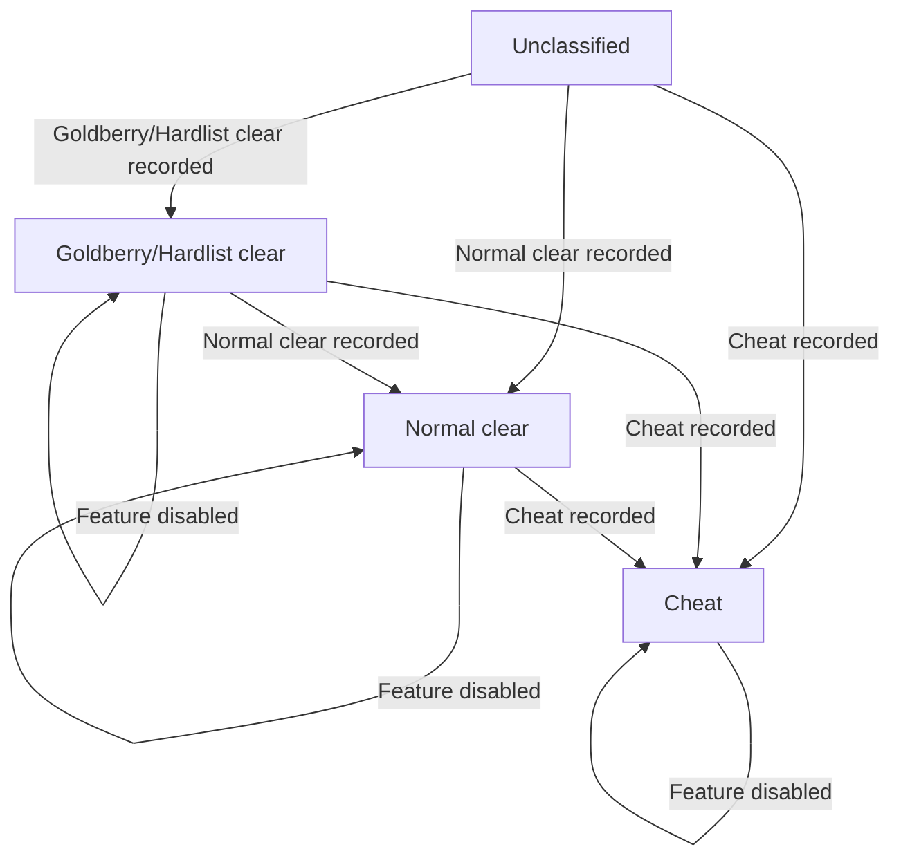

Akron classifies tools by their effect on an attempt. Practice, routing, accessibility, and proof tools can be Cheat when they change gameplay, expose hidden information, or weaken evidence for a submitted clear.

Use this page when you want to understand why a feature has a policy badge. Use the [Feature guide](/feature-guide) when you need the current classification for a specific overlay row.

## The three classes

| Class | Meaning | Typical examples |
|---|---|---|
| Goldberry/Hardlist clear | Akron treats the behavior as compatible with its strictest supported clean category. | Input display, proof capture helpers, simple confirmation prompts. |
| Normal clear | Akron's ordinary-play category for behavior that is not strict-approved by default. | Room labels, visual presentation, audio routing, retry and workflow helpers. |
| Cheat | The behavior changes gameplay, exposes hidden or exact internal state, manipulates run state, or changes proof assumptions. | StartPos restore, warps, hitboxes, noclip, infinite resources, timescale, input-assist shortcuts. |

These are technical classifications for attempt recording and safeguards.

A policy badge shows the registry classification for a row or suboption. The attempt-status chip shows the strictest classification recorded for the current attempt. Displaying a badge does not mean that row has already changed the attempt status.

## How Akron decides

Akron starts from the most conservative question: "Could this affect how the attempt was played, judged, or proven?" If the answer is yes, the feature is usually stricter than a plain presentation option.

| Question | Classification pressure |
|---|---|
| Does it only show already-visible player input or proof setup? | Usually Goldberry/Hardlist clear. |
| Does it change presentation without changing simulation, save data, or player control? | Usually Normal clear. |
| Does it expose exact internal state that vanilla play does not show? | Usually Cheat. |
| Does it move the player, restore state, alter resources, or change physics? | Cheat. |
| Does it synthesize, redirect, or automate execution inputs? | Cheat. |
| Does it freeze, rewrite, or hide timing evidence? | Usually Cheat. |
| Does it only import, export, or organize settings? | Usually Normal clear unless the imported state is used to enable Cheat behavior. |

When a feature has mixed behavior, Akron classifies the smallest behavior it can track. A parent row can be clean while a suboption is stricter.

## Goldberry/Hardlist clear

Goldberry/Hardlist clear is Akron's strict clean bucket. It is for behavior that Akron treats as safe for the strictest supported contexts because it is passive, proof-oriented, or already accepted by the policy model.

Common reasons:

- It displays local inputs without changing them.
- It records or warns about proof setup.
- It confirms destructive actions before they happen.
- It reports simple counters without giving hidden routing advantage.

Examples:

| Behavior | Why it fits |
|---|---|
| Current input display | Shows what the player is pressing. |
| Input history base display | Shows recent local input state for review. |
| Proof recorder guard | Warns about missing recording or replay setup. |
| End screen helper | Keeps proof capture settings visible and recorded. |
| Completion clip controls | Recording workflow, not gameplay mutation. |

## Normal clear

Normal clear is Akron's ordinary-play category for behavior that is not strict-approved by default. It often covers quality-of-life, accessibility, overlay, and workflow features, but it is not limited to behavior that leaves gameplay untouched.

Common reasons:

- It changes presentation or readability.
- It displays broad local status.
- It helps with workflow outside the actual execution of a clear.
- It integrates with external tools without delegating control or restoring state.

Examples:

| Behavior | Why it fits |
|---|---|
| Room labels | Shows passive room information. |
| Audio speed or pitch | Changes audio playback while preserving simulation timing. |
| Streamer Mode | Redacts local paths from Akron-owned UI and proof output. |
| Import/export setup | Moves configuration between setups. |
| Visual noise reduction | Presentation change that strict submissions may still evaluate case by case. |

Akron's Normal clear label records no Cheat behavior; each leaderboard still applies its own rules.

## Cheat

Cheat is for behavior that changes the attempt, exposes information that normal play would not provide, or changes the assumptions used to judge evidence.

Common reasons:

- It mutates player state, level state, save data, physics, resources, or position.
- It restores a snapshot or jumps to a different room state.
- It reveals hidden map, entity, trigger, hitbox, flag, or exact resource information.
- It changes simulation cadence, frame behavior, timing, or proof assumptions.
- It automates or synthesizes execution inputs.

Examples:

| Behavior | Why it fits |
|---|---|
| StartPos restore | Restores saved player and room state. |
| Room warp or click teleport | Moves the player outside normal traversal. |
| Hitbox or trigger display | Reveals invisible collision or trigger regions. |
| Stamina, dash, or exact speed HUDs | Shows precise resource or movement state. |
| Custom HUD labels | Templates can show exact position, speed, resources, flags, and other internal state. |
| Noclip, invincibility, infinite resources | Changes core gameplay rules. |
| Timescale or TPS bypass | Changes simulation timing. |
| Neutral Drop or Backboost shortcuts | Synthesizes execution inputs. |

Akron records Cheat tool use to preserve context for submitted runs.

## Suboptions can be stricter

Check the exact option badge. A popup option can be stricter than its parent row.

Examples:

| Parent row | Stricter suboption reason |
|---|---|
| Map Capture | Freezing timers changes timing evidence. |
| Room Capture | Freezing timers changes timing evidence. |
| Safe Mode | Freezing deaths, jumps, or best-run stats rewrites saved stat outcomes. |
| Free Camera | Freezing gameplay while moving the camera changes level simulation. |

For players, read the badge and tooltip for the exact option you are enabling.

## Attempt status only escalates

During an attempt, Akron keeps the strictest classification recorded by its policy hooks. For actions that use `TryUse`, recording happens as soon as the invocation passes the policy check and before the action checks later runtime prerequisites. An action that fails afterward can therefore still raise the attempt status. Turning a feature off later does not erase the recorded classification.

A new or reset attempt starts as **Unclassified**. This is the state before Akron records a classification, not a fourth feature class.

```mermaid
flowchart TD
  unclassified["Unclassified"] -->|Goldberry/Hardlist clear recorded| strict["Goldberry/Hardlist clear"]
  unclassified -->|Normal clear recorded| normal["Normal clear"]
  unclassified -->|Cheat recorded| cheat["Cheat"]
  strict -->|Normal clear recorded| normal
  strict -->|Cheat recorded| cheat
  strict -->|Feature disabled| strict
  normal -->|Cheat recorded| cheat
  normal -->|Feature disabled| normal
  cheat -->|Feature disabled| cheat
```

This is intentional. Akron keeps recorded classifications throughout the attempt, including admitted invocations that later fail a runtime prerequisite.

## Contributor guidance

If you are adding or classifying a feature, use [Feature policy](/contributing/feature-policy) for implementation rules, registry requirements, and the contributor checklist.
