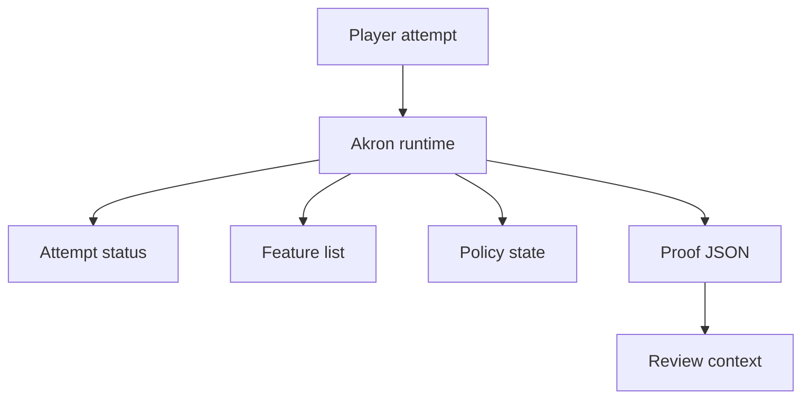

Akron can record proof-oriented metadata and guardrails, but it does not make a run legitimate by itself. It records Akron's view of active features, policy state, overrides, and proof settings so a reviewer has more context.

## What Akron records

Proof-oriented metadata can include:

- Visible policy and status state.
- Attempt classification (Goldberry/Hardlist clear, Normal clear, or Cheat).
- Active-feature list.
- Pause counts and paused duration.
- Map and loaded-module version context (via Map Version Stamp).
- End Screen Helper settings.
- Proof Recorder Guard state (whether recording or replay buffering is armed).
- Journal Snapshot/Compare output.

## What Akron does not prove

Akron does not:

- Certify a run as accepted by a leaderboard or event.
- Replace moderator review.
- Prove the absence of all external integrations.
- Make Cheat features acceptable for clean submissions.
- Hide or erase feature use by disabling a tool later.

<Warning>
  Proof metadata is context, not a verdict. Use the target community's submission rules as the authority for whether a run is accepted.
</Warning>

## Submission mode

Submission Mode enables proof-oriented guardrails and metadata without changing gameplay. Akron classifies Submission Mode as **Goldberry/Hardlist clear** because it records and warns rather than mutating play.

Related proof helpers include Proof Recorder Guard, End Screen Helper, Pause Tracker, Map Version Stamp, Golden Start Helper, Lag Pauser, and Journal Snapshot/Compare. Each helper carries its own policy classification; enabling Submission Mode does not make every helper Goldberry/Hardlist clear.

For proof overlay behavior that controls what appears on screen during a run, see [Streamer Mode, Proof Mode, and Low-Distraction Overlays](/concepts/proof-and-submission-mode).

## Proof workflow

<Steps>
  <Step title="Start from the intended setup">
    Use the setup required by the target submission workflow before the attempt starts. If that workflow requires specific Akron settings, apply them through direct configuration or `.akr` setup import.
  </Step>
  <Step title="Enable proof helpers">
    Enable only the proof helpers that match the target submission requirements.
  </Step>
  <Step title="Check the status before the run">
    Confirm the current attempt is in the expected status before beginning.
  </Step>
  <Step title="Export or capture proof output">
    Use proof sidecar, recorder, screenshot, or journal tools according to the target workflow.
  </Step>
  <Step title="Review the output">
    Inspect the output before submitting. Akron reports what it recorded, but you still need to verify that the package is complete.
  </Step>
</Steps>
