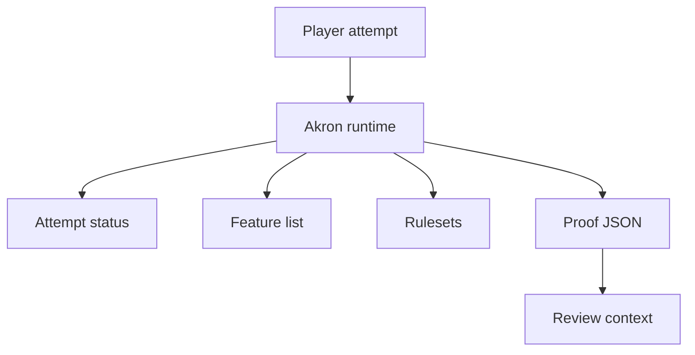

Akron can record proof-oriented metadata and guardrails, but it does not make a run legitimate by itself. It records Akron's view of active features, rulesets, overrides, and proof settings so a reviewer has more context.

## What Akron Records

Proof-oriented surfaces can include:

- Active rulesets and overlay rulesets.
- Attempt classification.
- Active-feature list.
- Pause counts and paused duration.
- Map and loaded-module version context.
- End-screen helper settings.
- Recorder guard state.
- Journal snapshot and compare output.

## What Akron Does Not Prove

Akron does not:

- Certify a run as accepted by a leaderboard or event.
- Replace moderator review.
- Prove the absence of all external tools.
- Make Cheat features acceptable for clean submissions.
- Hide or erase feature use by disabling a tool later.

<Warning>
  Proof metadata is context, not a verdict. Use the target community's submission rules as the authority for whether a run is accepted.
</Warning>

## Submission Mode

Submission Mode enables proof-oriented guardrails and metadata without changing gameplay. It is classified as Goldberry/Hardlist clear in Akron because it records and warns rather than mutating play.

Related proof helpers include recorder guard, end-screen helper, pause tracker, map version stamp, golden start helper, lag pauser, and journal snapshot/compare. Each helper keeps its own policy status; enabling Submission Mode does not make every helper Goldberry/Hardlist clear.

## Proof Workflow

<Steps>
  <Step title="Set the intended ruleset">
    Open Everest's mod options for Akron and use `Leaderboard-clean` or the relevant community ruleset before the attempt starts.
  </Step>
  <Step title="Enable proof helpers">
    Enable only the proof helpers that match the target submission requirements.
  </Step>
  <Step title="Check the status before the run">
    Confirm the current attempt is in the expected status before beginning.
  </Step>
  <Step title="Export or capture proof output">
    Use proof sidecar, recorder, screenshot, or journal tools according to the target workflow.
  </Step>
  <Step title="Review the output">
    Inspect the output before submitting. Akron can report what it recorded, but you still need to verify that the package is complete.
  </Step>
</Steps>
