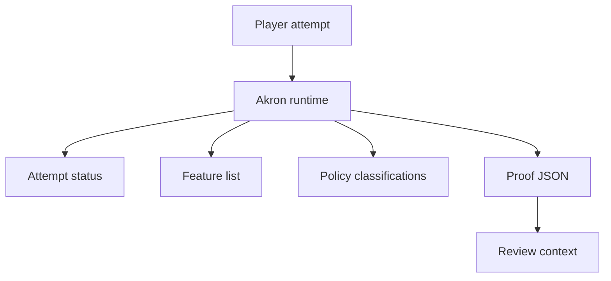

Akron records its view of active features, policy classifications, overrides, and proof settings so a reviewer has more context.

## What Akron records

Proof-oriented metadata can include:

- Visible policy classification (Goldberry/Hardlist clear, Normal clear, or Cheat) and attempt status. A new or reset attempt can be Unclassified.
- Active-feature list.
- Pause counts and paused duration.
- Map and loaded-module version context (via Map Version Stamp).
- End Screen Helper settings.
- Proof Recorder Guard state (whether recording or replay buffering is armed).
- Journal Snapshot/Compare output.

```mermaid
flowchart TD
  player["Player attempt"] --> akron["Akron runtime"]
  akron --> status["Attempt status"]
  akron --> features["Feature list"]
  akron --> policy["Policy classifications"]
  akron --> proof["Proof JSON"]
  proof --> review["Review context"]
```

## What Akron does not prove

Akron does not:

- Certify a run as accepted by a leaderboard or event.
- Replace moderator review.
- Prove the absence of all external integrations.
- Make Cheat features acceptable for clean submissions.
- Hide or erase feature use by disabling a tool later.

<Warning>
  Proof metadata is context, not a verdict. Use the target community's submission rules as the authority for whether a run is accepted.
</Warning>

## When a sidecar is written

Akron writes a proof sidecar on every area completion, whatever the attempt's classification and whether or not a proof helper is on. The sidecar is the record of what the run was played with. The on-screen proof panel is a helper surface, so it appears only when Proof-mode Overlay or End Screen Helper is on, or when the attempt is not a Goldberry/Hardlist clear.

Sidecars are written to `Saves/AkronProof` and named by the time they were written, to the millisecond, so two written together do not replace each other.

## Submission Mode

Submission Mode enables proof-oriented guardrails and metadata without changing gameplay. Akron classifies it as **Goldberry/Hardlist clear** because its behavior is limited to records and warnings.

Turning it on arms Proof-mode Overlay, Proof Recorder Guard, End Screen Helper, Pause Tracker, and Map Version Stamp, and remembers what each was. Turning it off puts those five values back, so the mode is something you can leave. A setup pack states all six values outright, so importing one leaves nothing for a later "off" to restore.

Related proof helpers include Proof Recorder Guard, End Screen Helper, Pause Tracker, Map Version Stamp, Golden Start Helper, Lag Pauser, and Journal Snapshot/Compare. Each helper carries its own policy classification; enabling Submission Mode does not make every helper Goldberry/Hardlist clear.

For path redaction in Akron-owned UI, see [Streamer Mode](/player-guide/hud-and-input-tools#streamer-mode).

## Proof workflow

For the steps to prepare, capture, and review a proof-oriented attempt, use [Capture and recording](/player-guide/capture-and-recording#capture-a-proof-oriented-attempt).
