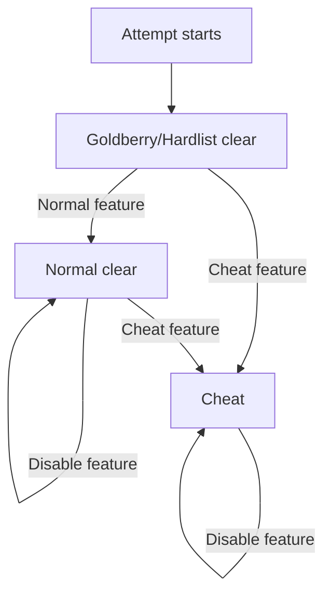

Akron tracks the active attempt status while its policy settings decide whether features are allowed, blocked, or recorded as attempt-changing. The overlay shows this status during play; detailed ruleset selection is an advanced settings, command, and import path rather than the main overlay workflow.

## The Three Statuses

| Status | Meaning | Typical use |
|---|---|---|
| Goldberry/Hardlist clear | Strict clean state for features Akron treats as allowed under the strictest supported contexts. | Input display, proof capture settings, simple comfort controls. |
| Normal clear | Normal clear for ordinary play, but not necessarily approved for stricter Goldberry/Hardlist contexts. | Visual presentation, audio routing, room labels, workflow helpers. |
| Cheat | The feature mutates gameplay, exposes hidden information, changes proof assumptions, or manipulates state. | StartPos restore, warps, hitboxes, timescale, noclip, infinite resources. |

Akron does not use Yellow, Practice, or any extra room-lab status. State-changing tools can be useful and still be Cheat for submitted clean clears.

## Monotonic Escalation

Disabling a feature does not undo earlier use. This is intentional: Akron records what happened during the attempt, not only the current menu state.

## What Rulesets Do

Rulesets are Akron's internal policy presets. They control the current policy environment, but most player-facing docs should start from the overlay row or setup pack a user can actually see. A ruleset can:

- Allow a feature.
- Block a feature before it changes state.
- Let the feature run while marking the attempt.
- Add presentation rules such as redaction or proof-focused output.

Rulesets can stack. For example, a primary ruleset can define the clean-play policy while an overlay state hides local filesystem paths from Akron UI and exported proof output.

## How To Read Policy Badges

Policy badges describe the smallest tracked behavior Akron knows about. A clean parent row can contain a stricter tooltip suboption.

<Warning>
  Always read the suboption text. A popup option can be stricter than the parent row when it changes timers, freezes stats, exposes hidden state, or mutates gameplay.
</Warning>

## Common Examples

| Behavior | Status | Why |
|---|---|---|
| Simple input display | Goldberry/Hardlist clear | Displays local inputs without changing gameplay. |
| Room labels | Normal clear | Shows local room information, but strict submissions may evaluate overlays case by case. |
| Audio speed or pitch | Normal clear | Presentation/accessibility setting that does not change simulation timing. |
| StartPos restore | Cheat | Restoring a saved StartPos changes player state or position. |
| Hitbox viewer | Cheat | Reveals internal collision information. |
| FPS/TPS bypass | Cheat | Changes draw or simulation targets and invalidates normal proof assumptions. |

Use [Feature status reference](/reference/feature-status-reference) for the current list.
