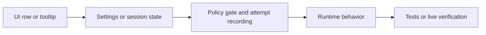

Use this reference when a change spans UI, settings, policy, runtime behavior, `.akr` packs, commands, HUD, or tests. It defines where new code must reside to ensure contributor changes remain focused.

## Feature Flow

Most feature work crosses these layers:

## Primary Files

| Concern | Primary files |
|---|---|
| Feature kind and policy metadata | `Source/Core/AkronTypes.cs`, `Source/Core/AkronFeatureRegistry.cs` |
| Overlay rows, control type, tooltip controls | `Source/Overlay/AkronOverlay.cs` plus focused `Source/Overlay/akron-overlay-*.cs` partials |
| Persisted settings and setup state | `Source/Module/AkronModuleSettings.cs`, `Source/Module/akron-module-settings-*.cs`, `Source/Profiles/akron-profile-*.cs` |
| Runtime behavior | `Source/Module/AkronModule.cs`, `Source/Actions/akron-actions.cs`, `Source/Runtime/akron-runtime-options.cs`, feature-specific runtime partials |
| HUD rendering | `Source/Hud/AkronHudRenderer.cs`, `Source/Hud/akron-hud-*.cs` |
| Save/load internals | `Source/SaveLoad/AkronSaveLoad.cs`, `Source/SaveLoad/akron-save-load-*.cs` |
| Internal recording | `Source/Recorder/akron-internal-recorder*.cs`, `Source/Recorder/akron-internal-audio-recorder.cs` |
| `.akr` import/export | `Source/Profiles/akron-profile-packs.cs`, `Source/Profiles/akron-profile-file-picker.cs`, `Source/Packs/akron-archive.cs` |
| Debug and automation commands | `Source/Commands/akron-commands.cs`, `Source/Commands/akron-*-commands.cs` |
| Verification | `tests/feature-registry-tests.cs`, `tests/module-settings-tests.cs`, feature-specific tests |

## Adding A Feature

Start from behavior, not from the UI label.

1. Decide whether the feature is a toggle, button, numeric toggle, radio/dropdown mode, checkbox list, or read-only label.
2. Add settings only for state that must persist.
3. Keep transient runtime state in session or a focused service.
4. Add an `AkronFeatureKind` only if runtime policy checks or attempt tracking need a reusable policy unit.
5. Add the `FeatureDefinition` and any UI-only label or suboption classifications.
6. Add the overlay row with the control type that matches the interaction.
7. Gate runtime behavior with `TryUse` when the behavior should record use.
8. Use `CanUse` when code only needs to decide whether a surface should render or be available.
9. Add tests for classification, defaults, clamps, archive shape, or non-trivial behavior.
10. Update docs when visible behavior, policy, file locations, debug commands, or `.akr` contracts change.

## Overlay Boundaries

Keep `Source/Overlay/AkronOverlay.cs` focused on overlay orchestration. Use existing row helpers before adding UI machinery.

| Helper or pattern | Use when |
|---|---|
| `PolicyToggle` | A boolean feature maps to one `AkronFeatureKind`. |
| `NumericToggle` | The row toggles the feature, while a tooltip value controls intensity or amount. |
| `LabelPolicyToggle` | A label/HUD surface is toggleable and policy-visible. |
| `Action` | The row performs a one-shot command such as export, import, warp, capture, save, load, reset, or clear. |
| Custom popup controls | The row has several related values, radio options, or checkbox lists. |

Configuration changes should not activate a feature by themselves. A dropdown mode, numeric value, or checkbox inside a tooltip updates configuration only. The parent row decides whether that configuration is active.

Use focused overlay partials for feature families:

| Surface | Boundary |
|---|---|
| Shared row/action/layout models | `Source/Overlay/akron-overlay-models.cs` |
| Core row catalogs | `Source/Overlay/akron-overlay-entries.cs` |
| Label row catalogs | `Source/Overlay/akron-overlay-label-entries.cs` |
| Keybind overview rows | `Source/Overlay/akron-overlay-keybind-entries.cs` |
| Interop rows | `Source/Overlay/akron-overlay-interop-entries.cs` |
| Search input and aliases | `Source/Overlay/akron-overlay-search.cs`, `Source/Overlay/akron-overlay-copy.cs` |
| Menu-binding actions and capture | `Source/Overlay/akron-overlay-bindable-actions.cs` |
| Overlay layout calculation | `Source/Overlay/akron-overlay-layout.cs` |
| ImGui menu/action rendering | `Source/Overlay/akron-overlay-imgui-renderer.cs` |
| ImGui value-row controls | `Source/Overlay/akron-overlay-imgui-value-rows.cs` |
| ImGui popups and tooltips | `Source/Overlay/akron-overlay-imgui-popups.cs` |
| Fallback SpriteBatch rendering | `Source/Overlay/akron-overlay-sprite-renderer.cs` |
| Fallback option popup dispatch | `Source/Overlay/akron-overlay-options-popup.cs` |
| Mouse-driven placement modes | `Source/Overlay/akron-overlay-placement.cs` |
| Recorder popups | `Source/Overlay/akron-overlay-recorder-popups.cs` |
| Auto Kill and Auto Deafen popups | `Source/Overlay/akron-overlay-automation-popups.cs` |
| Shell, appearance, and keybind popups | `Source/Overlay/akron-overlay-shell-popups.cs` |
| HUD label popups | `Source/Overlay/akron-overlay-label-popups.cs` |
| Noclip and Hazard Accuracy popups | `Source/Overlay/akron-overlay-noclip-popups.cs` |
| Gameplay option popups | `Source/Overlay/akron-overlay-gameplay-popups.cs` |
| Runtime and bypass popups | `Source/Overlay/akron-overlay-bypass-popups.cs` |
| StartPos popups | `Source/Overlay/akron-overlay-startpos-popups.cs` |
| Visual and camera popups | `Source/Overlay/akron-overlay-visual-popups.cs` |
| Status popups | `Source/Overlay/akron-overlay-status-popups.cs` |
| Extended Variant popups | `Source/Overlay/akron-overlay-extended-variant-popups.cs` |
| Input/resource HUD popups | `Source/Overlay/akron-overlay-resource-popups.cs` |
| Madeline visual popups | `Source/Overlay/akron-overlay-madeline-popups.cs` |
| Runtime utility popups | `Source/Overlay/akron-overlay-runtime-popups.cs` |

`Source/Overlay/akron-overlay-popup-controls.cs` is a containment boundary for the current option-popup catalog. When a popup grows into a full editor, browser, or feature-family surface, move that family into a smaller focused partial instead of growing the catalog further.

## Module And Runtime Boundaries

Keep `Source/Module/AkronModule.cs` focused on lifecycle and hook orchestration. If a feature family needs several helpers around one visual or runtime concept, put those helpers in a focused partial and call into it from the hook.

| Feature family | Boundary |
|---|---|
| Auto Kill and Auto Deafen runtime | `Source/Automation/akron-automation-runtime.cs` |
| Noclip movement, Hazard Accuracy, tint, and player visibility/depth overrides | `Source/Runtime/akron-noclip-runtime.cs` |
| Click teleport, cursor zoom, transition speed, StartPos placement fallback, trails, and player visuals | `Source/Module/akron-module-visual-runtime.cs` |
| Death handling, respawn overrides, player update hooks, dash/jump hooks, and player counters | `Source/Module/akron-module-player-runtime.cs` |
| Retry, reload, save/load actions, prompts, ruleset conflicts, and automation action wrappers | `Source/Module/akron-module-actions.cs` |
| Native Everest mod menu and menu-only helpers | `Source/Module/akron-module-menu.cs` |
| Overlay visibility, hotkey dispatch, cursor capture, and keyboard/gamepad binding helpers | `Source/Module/akron-module-overlay-input.cs` |
| Reduced visual-noise hooks | `Source/Runtime/akron-visual-noise-runtime.cs` |
| StartPos capture, restore, slot wrapping, smart respawn lookup, and camera relinking | `Source/Actions/akron-startpos-actions.cs` |
| Completion clearing, native unlocks, berry obtain, and unlock-state persistence | `Source/Actions/akron-unlock-actions.cs` |
| Room-stat timing and TSV export | `Source/Runtime/akron-practice-stats.cs` |

## Settings Boundaries

Keep the main settings file focused on persisted properties, menu entries, formatting, and clamp helpers.

| Settings concern | Boundary |
|---|---|
| Profile capture | `Source/Profiles/akron-profile-settings.cs` |
| Profile application | `Source/Profiles/akron-profile-state-apply.cs` |
| Stored profile slot selection and built-in profile/ruleset catalogs | `Source/Profiles/akron-profile-state-catalog.cs` |
| Ruleset/profile/status formatting, streamer-mode path display, binding labels, low-distraction channels, hitbox style reset, and native menu entries | `Source/Module/akron-module-settings-display.cs` |
| Overlay-toggle defaults and HUD label row ordering | `Source/Module/akron-module-settings-label-rows.cs` |
| HUD-facing settings and HUD label style cloning | `Source/Module/akron-module-settings-hud.cs` |
| Generic clamps, normalization, range resolution, and auto-area copy helpers | `Source/Module/akron-module-settings-clamps.cs` |
| Internal Recorder filename, buffer, codec, container, quality, and resolution defaults/clamps | `Source/Module/akron-module-settings-recording.cs` |

Defaults should be opt-in for anything that changes gameplay, reveals hidden information, changes proof assumptions, or adds an overlay. Tests should lock those defaults.

For numeric settings:

- Add a clamp helper when the value comes from user input or profile import.
- Use invariant-culture parsing for command and debug paths.
- Keep the row label as on/off when the feature has an enabled state.
- Put numeric configuration in the option menu.

## Save, HUD, And Inspector Boundaries

Keep `Source/SaveLoad/AkronSaveLoad.cs` focused on save/load orchestration and native restore sequencing.

| Concern | Boundary |
|---|---|
| Broker routing, risk detection, unsafe-native override checks, and broker time/death preservation | `Source/SaveLoad/akron-save-load-broker.cs` |
| Data contracts | `Source/SaveLoad/akron-save-load-models.cs` |
| EntityList, renderer camera, and copied-Level graph repair helpers | `Source/SaveLoad/akron-save-load-graph.cs` |
| ModInterop export shims | `Source/SaveLoad/akron-save-load-exports.cs` |

Keep `Source/Hud/AkronHudRenderer.cs` as the high-level HUD orchestration surface.

| HUD concern | Boundary |
|---|---|
| Resource bars, dash/stamina HUD placement, speed, and dash number rendering | `Source/Hud/akron-hud-resource-renderer.cs` |
| World-space automation-area overlays, refill markers, and world rectangles | `Source/Hud/akron-hud-world-overlay-renderer.cs` |
| StartPos labels, placement previews, and screenshot-scanner markers | `Source/Hud/akron-hud-startpos-renderer.cs` |
| Input history, tap/input-board display, and inputs-per-second HUD | `Source/Hud/akron-hud-input-renderer.cs` |
| Trajectory preview simulation and drawing | `Source/Hud/akron-hud-trajectory-renderer.cs` |
| Label obstruction planning and overlap move/fade response | `Source/Hud/akron-hud-label-obstruction.cs` |

Hitbox viewer entity selection, last-death marker state, player trail capture, and render orchestration belong in `Source/Tools/akron-entity-inspector.cs`. Exact-pixel, circle-run, grid-outline, and outline sample geometry helpers belong in `Source/Tools/akron-entity-inspector-raster-geometry.cs`.

Custom HUD label rendering, template formatting, obstruction handling, and layout belong in `Source/Hud/akron-custom-hud-labels.cs`. Default label construction, cloning, active label mutation, preset insertion, and `.akr` label-pack import/export belong in `Source/Hud/akron-custom-hud-label-catalog.cs`.

## Command Boundaries

DebugRC and file-backed automation commands should route into the same runtime helpers as the overlay.

Keep `Source/Commands/akron-commands.cs` for shared command plumbing. Put focused command families in `Source/Commands/akron-*-commands.cs` files:

| Command family | Boundary |
|---|---|
| Broad status snapshot | `Source/Commands/akron-status-commands.cs` |
| Freeze, timescale, step-frame, proof/debug snapshot, and direct gameplay/debug commands | `Source/Commands/akron-gameplay-commands.cs` |
| Auto Kill and Auto Deafen | `Source/Commands/akron-automation-commands.cs` |
| Overlay and community-pack automation | `Source/Overlay/akron-overlay-commands.cs` |
| Internal Recorder | `Source/Commands/akron-recorder-commands.cs` |
| Room/map capture | `Source/Commands/akron-capture-commands.cs` |
| Live verification probes | `Source/Commands/akron-qa-commands.cs` |
| Input history, input board, and inputs per second | `Source/Commands/akron-input-commands.cs` |
| Resource and resource HUD | `Source/Commands/akron-resource-commands.cs` |
| MegaHack-public equivalent compatibility | `Source/Commands/akron-megahack-public-commands.cs` |
| Madeline visuals | `Source/Commands/akron-madeline-commands.cs` |
| Noclip, Hazard Accuracy, visual noise, and visual tuning | `Source/Commands/akron-visual-commands.cs` |
| Hitbox and entity inspector controls | `Source/Commands/akron-hitbox-commands.cs` |
| StartPos, state slot, save/load, and StartPos restore | `Source/Commands/akron-startpos-commands.cs` |
| Extended Variant Mode | `Source/Commands/akron-extended-variant-commands.cs` |
| Frame bypass and Motion Smoothing interop | `Source/Commands/akron-frame-bypass-commands.cs` |
| Camera offset and cursor zoom | `Source/Commands/akron-camera-commands.cs` |
| Low volume, unlocks, and berry obtain bypass options | `Source/Commands/akron-bypass-commands.cs` |
| Broad `akron_feature` toggle wrapper | `Source/Commands/akron-feature-commands.cs` |
| Custom HUD labels | `Source/Commands/akron-label-commands.cs` |
| Autosave, spinner deload simulation, and per-SFX volume | `Source/Commands/akron-utility-commands.cs` |

## Review Traps

Before finishing a feature, check for these common mistakes:

- A tooltip setting activates behavior without the parent toggle being on.
- A button was implemented as a toggle.
- A Cheat suboption inherits a clean parent badge.
- A runtime draw check records feature use merely because a menu is open.
- A persisted setting was added to `AkronModuleSettings` but not to profile capture/apply.
- A new `.akr` payload accepts extra ZIP entries or missing manifests.
- A docs update changed policy wording but the registry/tests still say something else.
