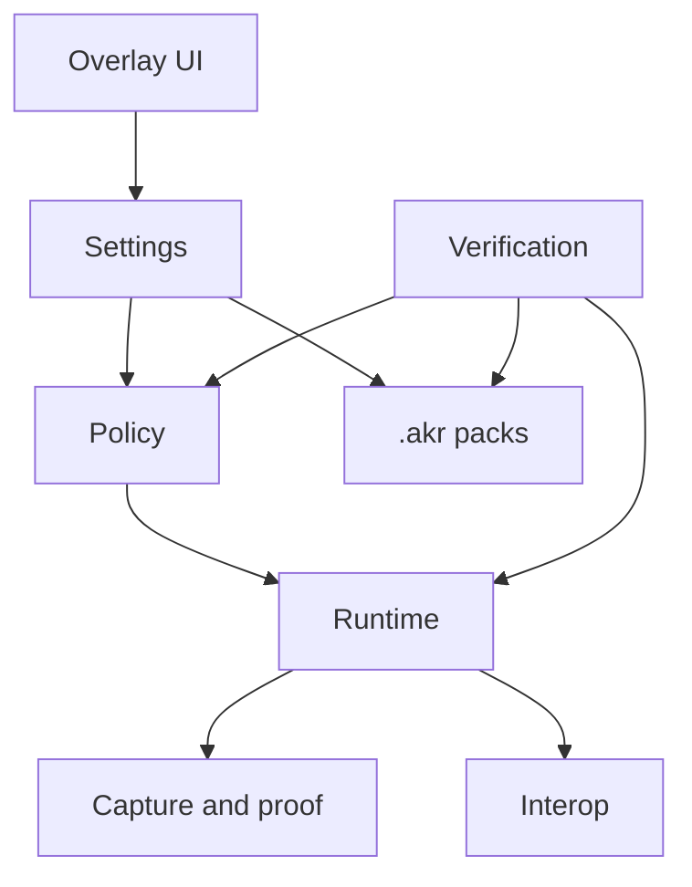

Akron is structured around several core public concepts: overlay UI, persisted settings, `.akr` packs, policy gates, runtime services, capture/proof output, and verification tests.

## System Shape

## Main Boundaries

| Boundary | Responsibility |
|---|---|
| Overlay | Presents rows, actions, popups, search, policy badges, and feature-specific browsers. Large browser surfaces, complex popup editors, fallback rendering, search, action binding, and layout helpers live in focused overlay partials. |
| Settings | Stores user-configurable values and persisted setup state. Setup capture, setup application, HUD settings, defaults, clamps, display helpers, and recorder settings live in focused partials. |
| Policy | Classifies features and records or blocks use under active policy. |
| Runtime | Applies gameplay, visual, capture, interop, proof behavior, and module lifecycle hooks. Feature-family runtime, command, HUD, save/load, recorder, and inspector logic should live beside that feature family instead of in the core module file. |
| `.akr` packs | Exports/imports scoped settings. Setup archive contracts and section copying live in the setup-pack service; OS-specific file picker process launching lives in a focused setup file-picker partial. |
| Tests | Enforce registry coverage, defaults, archive safety, and behavior contracts. |

## Policy Calls

Use the policy system according to intent:

- Use `TryUse` when behavior should count as feature use.
- Use `CanUse` when code only needs to decide whether a surface should render or be available.
- Use registry lookups for tooltip badges and static policy display.

For detailed source ownership, see [Implementation boundaries](/contributing/implementation-boundaries).
