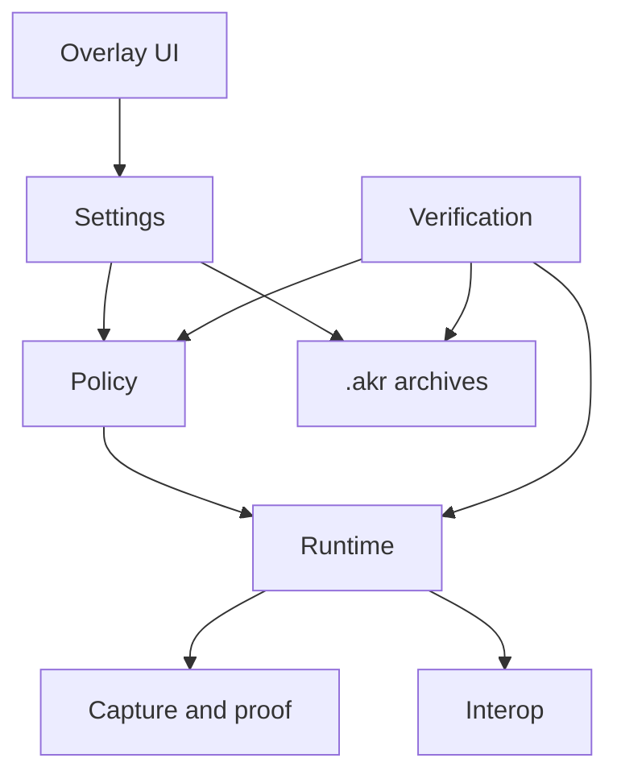

Akron is structured around several core public concepts: overlay UI, persisted settings, `.akr` archives, policy gates, runtime services, capture/proof output, and verification tests.

## System shape

```mermaid
flowchart TD
  overlay["Overlay UI"] --> settings["Settings"]
  settings --> policy["Policy"]
  policy --> runtime["Runtime"]
  settings --> packs[".akr archives"]
  runtime --> capture["Capture and proof"]
  runtime --> interop["Interop"]
  tests["Verification"] --> policy
  tests --> packs
  tests --> runtime
```

## Main boundaries

| Boundary | Responsibility |
|---|---|
| Overlay | Presents rows, actions, popups, search, classification tooltips, and feature-specific browsers. Large surfaces live in focused feature files or overlay partials. |
| Settings | Stores user-configurable values and persisted setup state. Setup capture, setup application, HUD settings, defaults, clamps, display helpers, and recorder settings live in focused partials. |
| Policy | Classifies features and records or blocks use under active policy. |
| Runtime | Applies gameplay, visual, capture, interop, proof behavior, and module lifecycle hooks. Feature-family runtime, command, HUD, save/load, recorder, and inspector logic should live beside that feature family instead of in the core module file. |
| `.akr` archives | Imports and exports setup state, overlay themes, custom HUD labels, and control-display presets. The shared archive contract lives in `Source/Packs/akron-archive.cs`; each payload schema stays with its owning feature. |
| Tests | Enforce registry coverage, defaults, archive safety, and behavior contracts. |

## Policy calls

Use the policy system according to intent:

- Use `TryUse` when behavior should count as feature use.
- Use `CanUse` when code only needs to decide whether a surface should render or be available.
- Use the row's feature kind for its classification tooltip and static policy display.

For detailed source ownership, see [Implementation boundaries](/contributing/implementation-boundaries).
