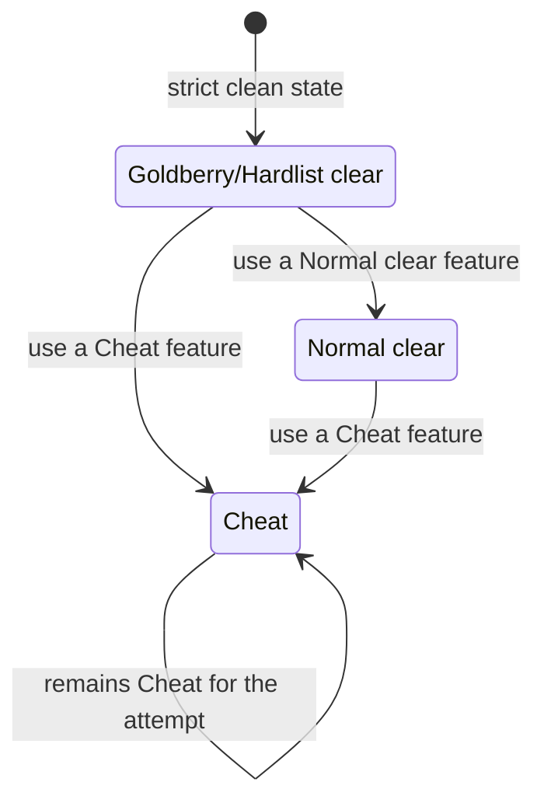

Use this tutorial after installing Akron. The goal is to open the overlay, confirm Akron is active, and understand the status shown by Akron.

<Steps>
  <Step title="Launch Celeste">
    Start Celeste through Everest with Akron enabled.
  </Step>
  <Step title="Open Akron">
    Use Akron's configured overlay bind. If the bind is unknown or conflicts with another mod, open Everest's keyboard/controller configuration and find Akron's overlay action.
  </Step>
  <Step title="Check the current setup">
    Look at the overlay status area for the ruleset stack and attempt status. Fresh installs should show Akron's default ruleset stack unless you changed it in Everest mod options.
  </Step>
  <Step title="Check the status chip">
    Akron shows whether the current attempt is still Goldberry/Hardlist clear, Normal clear, or Cheat. The status can escalate during an attempt, but it does not silently downgrade.
  </Step>
  <Step title="Try a harmless surface">
    Open a read-only HUD or label option such as room labels, then close the overlay and confirm normal gameplay continues.
  </Step>
</Steps>

## First Setup

Use the default setup if you are exploring Akron for the first time. It keeps most non-destructive configuration surfaces available without putting the session into a proof-oriented workflow.

Use `Practice` when you want repeated room setup and routing defaults. StartPos restore, warps, frame tools, timescale, and other state-changing tools still need to be enabled deliberately.

Use `Leaderboard-clean` when you want Akron to block or mark features that would conflict with a submitted clean clear.

## What The Status Means

The status is monotonic for the active attempt. Once a feature escalates the attempt, later disabling the feature does not pretend the earlier state never happened.

## Next Steps

- Configure core behavior in [Configuration](/getting-started/configuration).
- Set or recover binds in [Hotkeys](/getting-started/hotkeys).
- Learn the overlay in [Overlay](/player-guide/overlay).
- Read [Rulesets and status](/concepts/rulesets-and-status) before using Akron during submitted runs.
