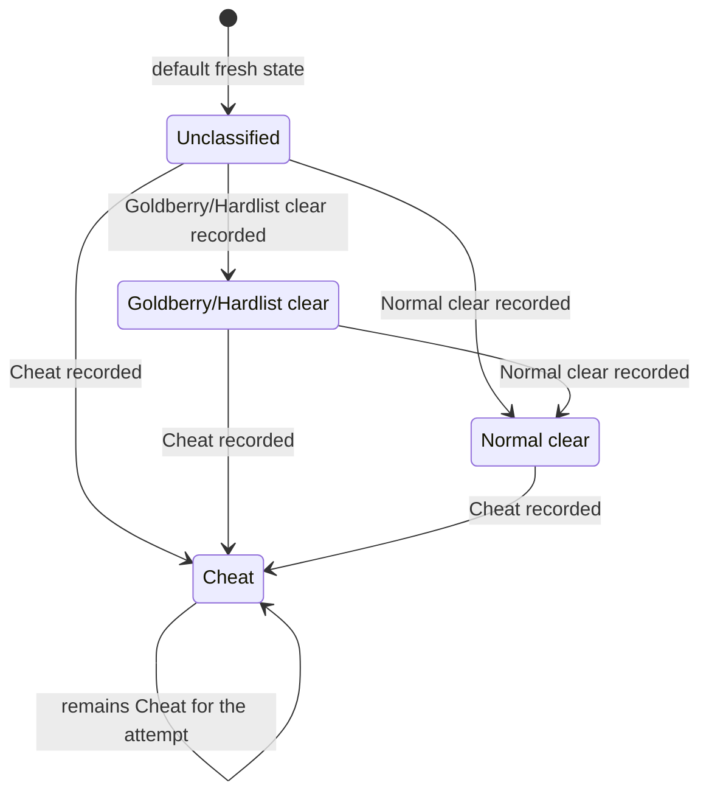

Follow this tutorial after installing Akron. Open the overlay, confirm Akron is active, and verify the status shown during play.

<Steps>
  <Step title="Launch Celeste">
    Start Celeste through Everest with Akron enabled.
  </Step>
  <Step title="Open Akron">
    Press `Tab`, the default overlay bind. If this bind was changed or conflicts with another mod, configure it in Everest's mod options.
  </Step>
  <Step title="Check the status chip">
    Akron shows the current attempt status: Unclassified, Goldberry/Hardlist clear, Normal clear, or Cheat. Fresh attempts start Unclassified until Akron's policy hooks record a classification. The status can escalate during an attempt, but it does not downgrade.
  </Step>
  <Step title="Try a display option">
    Enable **Visible** and **Inputs per second** in the Labels tab. Close the overlay, press a few inputs, and confirm the input-rate label appears. Rendering **Inputs per second** changes the attempt status to Normal clear.
  </Step>
  <Step title="Clean up the test">
    Disable **Inputs per second** and **Visible** when the check is complete. The current attempt remains Normal clear because attempt status does not downgrade. A death or new level entry starts a new attempt. If **Inputs per second** remains enabled, rendering it can classify that new attempt again.
  </Step>
</Steps>

## First setup

Use the default setup while exploring Akron. Proof helpers and HUD widgets start disabled.

Use the overlay to enable only the tools you need. Invoking StartPos restore, warps, frame tools, timescale, and other state-changing tools can change the active attempt status, even when a later runtime prerequisite prevents the action from finishing.

## What the status means

```mermaid
stateDiagram-v2
  [*] --> unclassified: default fresh state
  unclassified: Unclassified
  strict: Goldberry/Hardlist clear
  normal: Normal clear
  cheat: Cheat
  unclassified --> strict: Goldberry/Hardlist clear recorded
  unclassified --> normal: Normal clear recorded
  unclassified --> cheat: Cheat recorded
  strict --> normal: Normal clear recorded
  strict --> cheat: Cheat recorded
  normal --> cheat: Cheat recorded
  cheat --> cheat: remains Cheat for the attempt
```

The status is monotonic for the active attempt. Once a feature escalates the attempt, disabling the feature afterward does not revert the status to its previous level.

## Next steps

- Configure core behavior in [Configuration](/getting-started/configuration).
- Set or recover binds in [Hotkeys](/getting-started/hotkeys).
- Learn the overlay in [Overlay](/player-guide/overlay).
- Read [Clean vs cheat](/concepts/clean-vs-cheat) before relying on Akron during submitted runs.
