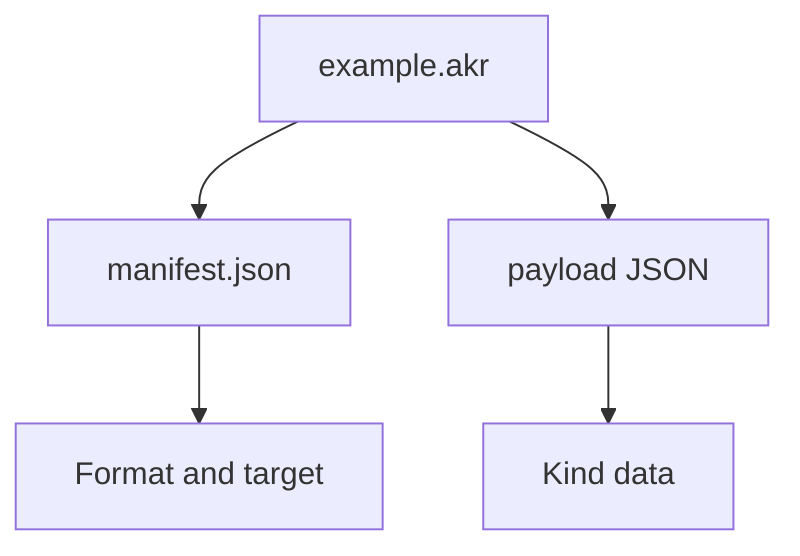
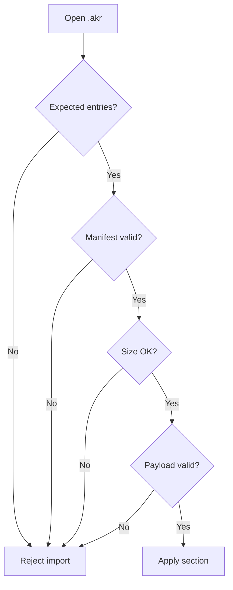

Akron uses `.akr` files for shareable structured setup data. An `.akr` file is a ZIP archive with a strict manifest plus one payload. This keeps imports explicit and prevents unrelated files from being smuggled into a pack.

## Archive Shape

Every archive must contain exactly two entries:



No folders, extra entries, rooted paths, backslashes, or `..` path segments are allowed. The reader rejects archives that do not match the expected payload name and kind.

## Manifest

`manifest.json` uses this shape:

```json
{
  "Format": "akron-archive",
  "FormatVersion": 1,
  "Kind": "profile",
  "KindVersion": 1,
  "CreatedBy": "Akron",
  "CreatedAt": "2026-05-14T00:00:00.0000000Z",
  "Target": {
    "Game": "Celeste",
    "MapSid": ""
  }
}
```

| Field | Meaning |
|---|---|
| `Format` | Must be `akron-archive`. |
| `FormatVersion` | Current value: `1`. |
| `Kind` | Payload kind. Setup packs currently use the archive kind `profile`. |
| `KindVersion` | Version of that payload kind. Must be positive. |
| `CreatedBy` | Producer label. Defaults to `Akron`. |
| `CreatedAt` | UTC creation timestamp when available. |
| `Target.Game` | Target game. Akron setup packs use `Celeste`. |
| `Target.MapSid` | Optional map SID for map-scoped payloads. |

The manifest size limit is 16 KiB.

## Setup Payload

Akron setup packs use the profile archive contract:

```text
Kind: profile
Payload entry: profile.json
Payload format: akron-profile-v1
Directory: Saves/AkronProfiles
```

`profile.json` uses this shape:

```json
{
  "Format": "akron-profile-v1",
  "Name": "Practice Audio",
  "CreatedUtc": "2026-05-14T00:00:00.0000000Z",
  "Section": "Audio",
  "ActiveProfile": "Practice",
  "State": {},
  "ButtonBindings": {},
  "MenuActionBindings": {},
  "StartPositions": {}
}
```

The setup payload size limit is 2 MiB.

## Setup Sections

| Section | Included data |
|---|---|
| `Whole` | Active setup state, button bindings, menu action bindings, and StartPos slots. |
| `StartPos` | StartPos settings and saved StartPos slots. |
| `Keybinds` | Everest `ButtonBinding` properties plus Akron menu action bindings. |
| `AutoKill` | Auto Kill toggles, timer, area settings, and rectangles. |
| `AutoDeafen` | Auto Deafen toggle, hotkey, area settings, and rectangles. |
| `Recorder` | Internal recorder output, replay, trigger, audio capture, codec, and preset settings. |
| `Audio` | Audio speed, pitch shift, per-sound volumes/overrides, and audio splitter devices. |
| `Hud` | HUD widgets, labels, input displays, resource bars, counters, and HUD presentation state. |

Scoped import intentionally merges only the selected section into the current active settings. It should not reset unrelated settings.

## Import Safety Rules

Imports fail closed:



Akron rejects unsupported archive formats, unsupported format versions, wrong kinds, missing or extra entries, oversized payloads, invalid JSON, and unsupported payload formats.

After a failed import, current settings should remain unchanged and Akron should show a short toast. Detailed errors belong in logs rather than user-facing toast text.

## Maintenance Requirements

Settings that travel through `.akr` setup packs require:

- A field in `AkronProfileState`.
- Capture from `AkronModuleSettings`.
- Apply back to `AkronModuleSettings`.
- Scoped-section copy behavior when the setting belongs to `StartPos`, `AutoKill`, `AutoDeafen`, `Recorder`, `Audio`, or `Hud`.
- Tests proving whole import/export and scoped import/export preserve the intended state.

Do not add compatibility shims for old local packs unless that support is explicitly required. Akron's current policy prefers one canonical contract and clear import errors.

New archive kinds are for payloads that are not setup/profile sections.

New archive kinds require:

- A unique `Kind`, payload entry name, payload format string, and payload size limit.
- Single-payload archive helpers.
- Simple payload entry names, such as `labels.json`.
- Unsupported payload-format rejection before state is applied.
- Tests for round-trip, wrong kind, extra entries, oversized payload, and missing manifest.
- Documentation on this page.

Do not put several unrelated payloads in one `.akr` archive. The current archive contract is one kind, one manifest, one payload.

Archive tests live in `tests/archive-tests.cs`.

```bash
dotnet test tests/akron-tests.csproj --nologo --filter ArchiveTests
```
