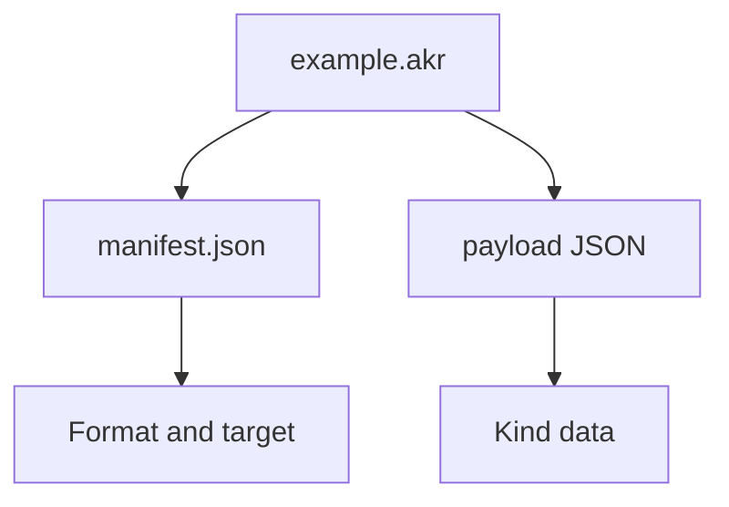
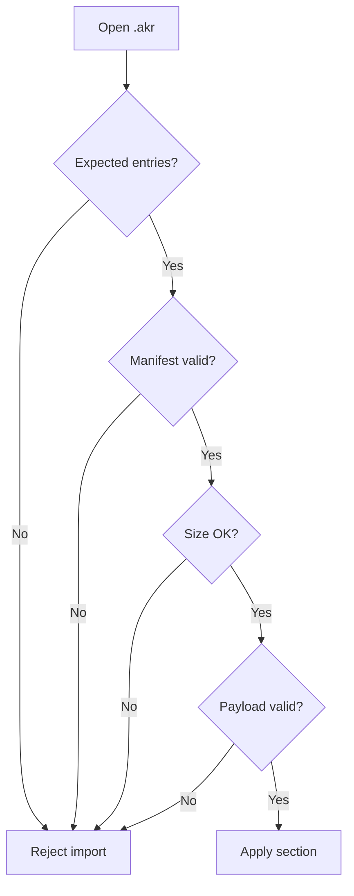

Akron uses `.akr` files to share structured setup data. An `.akr` file is a ZIP archive containing exactly one manifest and one payload. This structure ensures imports remain explicit and prevents unrelated files from being included in a pack.

## Archive Shape

An archive must contain exactly two entries:



The reader rejects archives containing folders, extra entries, rooted paths, backslashes, or `..` path segments, as well as those that do not match the expected payload name and kind.

## Manifest

The `manifest.json` file uses the following structure:

```json
{
  "Format": "akron-archive",
  "FormatVersion": 1,
  "Kind": "setup",
  "KindVersion": 1,
  "CreatedBy": "Akron",
  "CreatedAt": "2026-05-14T00:00:00.0000000Z",
  "Target": {
    "Game": "Celeste",
    "MapSid": ""
  }
}
```

| Field | Meaning |
|---|---|
| `Format` | Must be `akron-archive`. |
| `FormatVersion` | Current value: `1`. |
| `Kind` | Payload kind. Setup packs currently use the archive kind `setup`. |
| `KindVersion` | Version of that payload kind. Must be positive. |
| `CreatedBy` | Producer label. Defaults to `Akron`. |
| `CreatedAt` | UTC creation timestamp when available. |
| `Target.Game` | Target game. Akron setup packs use `Celeste`. |
| `Target.MapSid` | Optional map SID for map-scoped payloads. |

The manifest size limit is 16 KiB.

## Setup Payload

Setup packs use the `setup` archive contract:

```text
Kind: setup
Payload entry: setup.json
Payload format: akron-setup-v1
Directory: Saves/AkronSetups
```

The `setup.json` payload uses the following structure:

```json
{
  "Format": "akron-setup-v1",
  "Name": "Audio Setup",
  "CreatedUtc": "2026-05-14T00:00:00.0000000Z",
  "Section": "Audio",
  "State": {},
  "ButtonBindings": {},
  "MenuActionBindings": {},
  "StartPositions": {}
}
```

The setup payload size limit is 2 MiB.

## Setup Sections

| Section | Included Data |
|---|---|
| `Whole` | Active setup state, button bindings, menu action bindings, and StartPos slots. |
| `StartPos` | StartPos settings and saved StartPos slots. |
| `Keybinds` | Everest `ButtonBinding` properties plus Akron menu action bindings. |
| `AutoKill` | Auto Kill toggles, timer, area settings, rectangles, speed ranges, movement direction filters, dash-count conditions, grounded/airborne state, player state, and condition inversion. |
| `AutoDeafen` | Auto Deafen toggle, hotkey, area settings, and rectangles. |
| `Recorder` | Internal recorder output, replay, trigger, audio capture, codec, and preset settings. |
| `Audio` | Audio speed, pitch shift, per-sound volumes/overrides, and audio splitter devices. |
| `Hud` | HUD widgets, labels, input displays, resource bars, counters, and HUD presentation state. |

Scoped imports merge only the selected section into the current active settings without resetting unrelated settings.

## Import Safety Rules

Imports follow a "fail closed" policy:



Akron rejects archives with unsupported formats or versions, incorrect kinds, missing or extra entries, oversized payloads, invalid JSON, or unsupported payload formats.

If an import fails, current settings remain unchanged and a short toast notification is shown. Detailed errors are written to the logs rather than the user-facing toast.

## Maintenance Requirements

Settings included in `.akr` setup packs must meet these requirements:

- Must be defined as a field in `AkronSetupState`.
- Must support capture from `AkronModuleSettings`.
- Must support application back to `AkronModuleSettings`.
- Must implement scoped-section copy behavior when the setting belongs to `StartPos`, `AutoKill`, `AutoDeafen`, `Recorder`, `Audio`, or `Hud`.
- Must have automated tests proving whole import/export and scoped import/export preserve the intended state.

Avoid adding compatibility shims for old local packs unless explicitly required. Akron maintains a single canonical contract to ensure clear import errors.

New archive kinds are reserved for payloads that are not setup/setup sections.

New archive kinds require:

- A unique `Kind`, payload entry name, payload format string, and payload size limit.
- Dedicated single-payload archive helper methods.
- Simple payload entry names (e.g., `labels.json`).
- Unsupported payload-format rejection before state is applied.
- Comprehensive test coverage for round-trip, wrong kind, extra entries, oversized payload, and missing manifest.
- Complete technical documentation updated on this page.

Do not include multiple unrelated payloads in a single `.akr` archive. The current contract requires exactly one kind, one manifest, and one payload.

Archive tests live in `tests/archive-tests.cs`.

```bash
dotnet test tests/akron-tests.csproj --nologo --filter ArchiveTests
```
