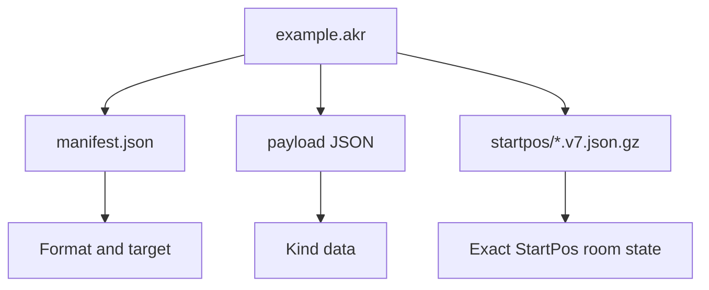
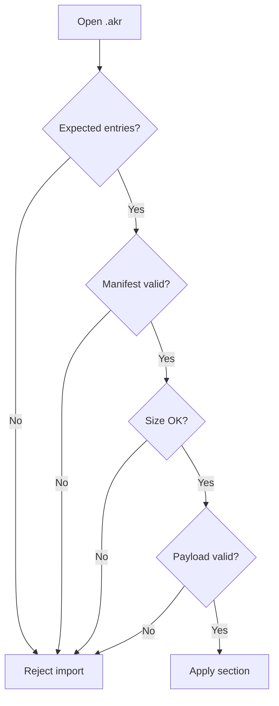

Akron uses `.akr` files to store and share setup sections, overlay themes, HUD labels, and control-display presets. An `.akr` file is a ZIP archive containing one manifest and one main payload. StartPos and Whole setup packs also contain the exact compressed snapshot named by each StartPos entry. The reader accepts only `manifest.json`, the main payload required by the archive kind, and StartPos attachments declared by `setup.json`.

## Archive shape

Most archives contain two entries. StartPos and Whole setup archives add one snapshot entry per StartPos:


```mermaid
flowchart TD
  archive["example.akr"] --> manifest["manifest.json"]
  archive --> payload["payload JSON"]
  archive --> snapshots["startpos/*.v7.json.gz"]
  manifest --> format["Format and target"]
  payload --> data["Kind data"]
  snapshots --> roomState["Exact StartPos room state"]
```

The reader rejects undeclared entries, rooted paths, backslashes, empty path segments, and `.` or `..` path segments, as well as archives that do not match the expected payload name and kind.

## Manifest

The `manifest.json` file uses the following structure:

```json
{
  "format": "akron-archive",
  "formatVersion": 1,
  "kind": "setup",
  "kindVersion": 1,
  "createdBy": "Akron",
  "createdAt": "2026-05-14T00:00:00.0000000Z",
  "target": {
    "game": "Celeste",
    "mapSid": ""
  }
}
```

| Field | Meaning |
|---|---|
| `format` | Must be `akron-archive`. |
| `formatVersion` | Must be `1`. |
| `kind` | Payload kind. See the current kinds below. The value is limited to 64 characters. |
| `kindVersion` | Must be `1`. |
| `createdBy` | Must be `Akron`. |
| `createdAt` | Required UTC creation timestamp ending in `Z`. |
| `target.game` | Must be `Celeste`. |
| `target.mapSid` | Required string for the target map SID. Use an empty string for payloads that are not map-scoped. The value is limited to 256 characters. |

The manifest must contain exactly these fields, including both fields in
`target`. Missing, extra, differently cased, or null fields are rejected. The
manifest size limit is 16 KiB.

## Current archive kinds

| Kind | Payload entry | Payload format | Payload limit | Default directory |
|---|---|---|---|---|
| `setup` | `setup.json` | `akron-setup-v4` | 2 MiB, plus declared StartPos attachments | `Saves/AkronSetups` |
| `theme` | `theme.json` | `akron-overlay-theme-v1` | 64 KiB | `Saves/AkronThemes` |
| `hud-labels` | `hud-labels.json` | `akron-hud-labels-v1` | 256 KiB | `Saves/AkronHudLabels` |
| `control-display` | `control-display.json` | `akron-control-display-v1` | 256 KiB | `Saves/AkronControlDisplay` |

Every current kind uses manifest `kindVersion` 1. The payload format has its own version and is validated before Akron applies imported state.

## Setup payload

Setup packs use the `setup` archive contract:

```text
kind: setup
Payload entry: setup.json
Payload format: akron-setup-v4
Directory: Saves/AkronSetups
```

The following abbreviated example shows the top-level shape of a Whole setup.
It is not an importable payload because `state` omits its required fields:

```json
{
  "format": "akron-setup-v4",
  "name": "Whole Setup",
  "createdUtc": "2026-05-14T00:00:00.0000000Z",
  "section": "Whole",
  "state": {},
  "buttonBindings": {},
  "menuActionBindings": {},
  "startPositions": {}
}
```

The reader requires the exact state fields owned by the declared section. It
rejects missing fields, extra fields, unknown enum values, and incorrectly
cased property names. `buttonBindings` and `menuActionBindings` are present
only for `Keybinds` and `Whole`. `startPositions` is present only for
`StartPos` and `Whole`. The payload `createdUtc` value must exactly match the
manifest `createdAt` value.

The setup payload size limit is 2 MiB.

Each compressed StartPos snapshot attachment is limited to 128 MiB. All
snapshot attachments in one setup archive are limited to 509 MiB in total.
Each expanded v7 snapshot is limited to 256 MiB while Akron validates it.
A `StartPos` or `Whole` archive can contain at most 99 StartPos entries. Each
slot key must be in the range 1-99.

## Portable setup validation limits

Akron applies these limits when it writes or reads a setup pack. Values outside
the ranges are rejected rather than clamped during pack validation.

| Data | Limit |
|---|---:|
| StartPos entries | 99 |
| Auto Kill areas | 128 |
| Auto Deafen areas | 128 |
| Custom HUD labels | 64 |
| Control Display elements | 48 |
| HUD row-order keys | 128 |
| Everest button bindings | 128 |
| Inputs in one Everest button binding | 16 total across keyboard, controller, and mouse inputs |
| Akron menu action bindings | 256 |
| Sound volume entries | 64 |
| Sound override entries | 64 |

| Value | Accepted range |
|---|---|
| StartPos coordinates | Finite values from -16,777,216 through 16,777,216 on each axis |
| StartPos dashes | `-1` for native, or 0-5 |
| StartPos stamina | `-1` for native, or 0-100 percent |
| Auto Kill and Auto Deafen rectangles | Width and height must be zero or greater |
| Recorder resolution | Width 320-3840, height 180-2160, and at most 8,294,400 total pixels |
| Recorder framerate | 1-120 FPS |
| Recorder bitrate | 1-200 Mbps |
| Replay buffer | 0-300 seconds |
| Clip pre-roll | 0-30 seconds |
| Clip post-roll | 0-30 seconds |
| Keyframe interval | 0-10 seconds |
| Endscreen duration | Finite value from 0-15 seconds |
| Recorder audio levels | 0-200 percent per track |
| Audio speed multiplier | Finite value from 0.1x-4.0x |
| Pitch multiplier | Finite value from 0.1x-4.0x |
| Per-sound volume | 0-200 percent |
| Control Display element bindings | Up to 16 action bindings and up to 16 keyboard bindings per element |

Required strings cannot be empty or whitespace. Optional strings can be empty,
but cannot exceed their listed length.

| String | Requirement |
|---|---|
| Setup pack name | Required, at most 256 characters |
| StartPos room and map SID | Required, at most 256 characters each |
| Everest binding name | Required, at most 128 characters, and must name a supported `ButtonBinding` property exactly |
| Keyboard, controller, or mouse binding input | Required, at most 64 characters, and must use the exact enum name |
| Akron menu action name | Required, at most 128 characters |
| Akron menu action binding | Required, at most 256 characters |
| Audio channel name | Required, at most 128 characters |
| Custom HUD label ID | Required, at most 128 characters |
| Custom HUD label name | Optional, at most 128 characters |
| Custom HUD label text | Optional, at most 4,096 characters |
| Control Display element ID | Required, at most 128 characters |
| Control Display element label | Optional, at most 128 characters |
| HUD row-order key | Required, at most 128 characters |

Every enum field must contain a defined named string value. Each StartPos entry
must use the archive name `startpos/<slot>.v7.json.gz` and a 64-character
lowercase hexadecimal SHA-256 digest.

## Setup sections

| Section | Included data |
|---|---|
| `Whole` | All portable setup state, button bindings, menu action bindings, and StartPos slots for the target map. |
| `StartPos` | StartPos settings and saved StartPos slots. |
| `Keybinds` | Everest `ButtonBinding` properties plus Akron menu action bindings. |
| `AutoKill` | Auto Kill toggles, timer, area settings, rectangles, speed ranges, movement direction filters, dash-count conditions, grounded/airborne state, player state, and condition inversion. |
| `AutoDeafen` | Auto Deafen toggle, area settings, and rectangles. The local hotkey is not included. |
| `Recorder` | Portable replay-buffer, trigger, audio-capture, codec, quality, and preset settings. |
| `Audio` | Audio speed, pitch shift, and per-sound volumes and overrides. |
| `Hud` | HUD widgets, labels, input displays, resource bars, counters, and HUD presentation state. |

Setup packs preserve machine-local values: the screenshot export path;
recording output folder, filename template, replay auto-start mode, and
colorspace arguments; audio-splitter state and device selections; and the Auto
Deafen hotkey. Whole exports omit these values too.

Scoped imports replace the selected portable settings without resetting
unrelated settings. A StartPos import also replaces every StartPos slot for the
archive's target map. Slots for other maps remain unchanged.

## Import safety rules

Imports follow a "fail closed" policy:


```mermaid
flowchart TD
  open["Open .akr"] --> entries{"Expected entries?"}
  entries -->|No| reject["Reject import"]
  entries -->|Yes| manifestCheck{"Manifest valid?"}
  manifestCheck -->|No| reject
  manifestCheck -->|Yes| sizeCheck{"Size OK?"}
  sizeCheck -->|No| reject
  sizeCheck -->|Yes| payloadCheck{"Payload valid?"}
  payloadCheck -->|No| reject
  payloadCheck -->|Yes| apply["Apply section"]
```

Akron rejects archives with unsupported formats or versions, incorrect kinds, missing or extra entries, oversized payloads, invalid JSON, or unsupported payload formats.

For each StartPos attachment, Akron verifies the declared checksum, map, and
room before applying the setup. It then binds the snapshot to the recipient's
active save-file slot. The exported attachment contains the captured active
map's berry progress, but import replaces that field with the recipient's
current active-map berry progress before binding the snapshot. Akron does not
import the author's progress or module save data.

If an import fails, current settings remain unchanged. Akron shows a short toast and writes the detailed error to its logs.

## Maintenance requirements

Settings included in `.akr` setup packs must meet these requirements:

- Must be defined as a field in `AkronSetupState`.
- Must support capture from `AkronModuleSettings`.
- Must support application back to `AkronModuleSettings`.
- Must implement scoped-section copy behavior when the setting belongs to `StartPos`, `AutoKill`, `AutoDeafen`, `Recorder`, `Audio`, or `Hud`.
- Must have automated tests proving whole import/export and scoped import/export preserve the intended state.

Avoid adding compatibility shims for old local packs unless explicitly required. Akron maintains a single canonical contract to ensure clear import errors.

New archive kinds are reserved for payloads that are not setup packs or setup sections.

New archive kinds require:

- A unique manifest `kind`, payload entry name, payload format string, and payload size limit.
- Dedicated single-payload archive helper methods.
- Simple payload entry names (e.g., `labels.json`).
- Unsupported payload-format rejection before state is applied.
- Tests for round-trip behavior, wrong kinds, extra entries, oversized payloads, and missing manifests.
- An update to this page that documents the complete contract.

Do not include multiple unrelated main payloads in a single `.akr` archive. The current contract requires exactly one kind, one manifest, and one main payload. Only StartPos snapshot attachments declared by `setup.json` are allowed.

Archive tests live in `tests/archive-tests.cs`.

```bash
dotnet test tests/akron-tests.csproj --nologo --filter ArchiveTests
```
