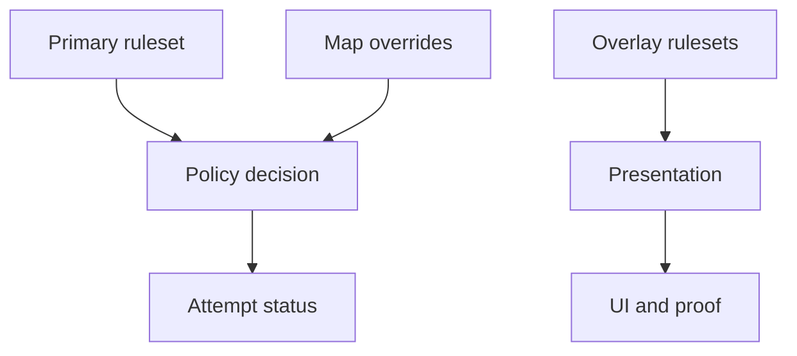

Rulesets define Akron's policy environment. They decide whether feature use is allowed, blocked, recorded, or presented differently.

This is an explanation page. For step-by-step configuration, see the Everest mod options screen or the `akron_ruleset` command. Player-oriented guides should start with the Akron overlay, visible attempt status, and setup packs.

## Built-in primary rulesets

| Ruleset | Purpose |
|---|---|
| `Casual` | QoL-first mode. State-changing features stay opt-in. |
| `Practice` | Room-lab defaults for StartPos setup, route review, HUD timing, input display, and death stats. |
| `Leaderboard-clean` | Blocks state-changing features. Akron shows explicit conflict prompts instead of auto-switching. |
| `Sandbox` | Removes Akron policy blocks. Does not auto-enable features for you. |
| `Everest-safe` | Conservative on unknown Everest content. Pushes risky compatibility decisions behind explicit overrides. |
| `Map-maker` | Favors inspection, reload, and debug traversal without automatically turning on overt gameplay cheats. |

## Overlay rulesets

| Overlay state | Purpose |
|---|---|
| `Streamer Mode` | Hides local filesystem paths by showing only filenames. |
| `Proof-mode` | Keeps proof surfaces compact and ruleset-aware. Normally enabled indirectly by Submission Mode or imported/community rulesets, not as a first-class player toggle. |
| `Low-distraction` | Derived state active when all visual-noise channels are disabled (particles, trails, glitch, anxiety, distortion). Not selected directly. |

## Ruleset stack

Primary rulesets control allowed behavior. Overlay states change presentation or proof output and appear in the current stack when active. Map compatibility overrides can affect risky runtime paths such as StartPos restore.

## Reading a ruleset

For each feature, ask:

1. Is the feature allowed in this ruleset?
2. If allowed, what status does it record?
3. Does any suboption have stricter behavior?
4. Does a map compatibility override change the runtime path?
5. Does an overlay state hide paths or add proof output?

See [Feature status reference](/reference/feature-status-reference) for the current feature classifications.
