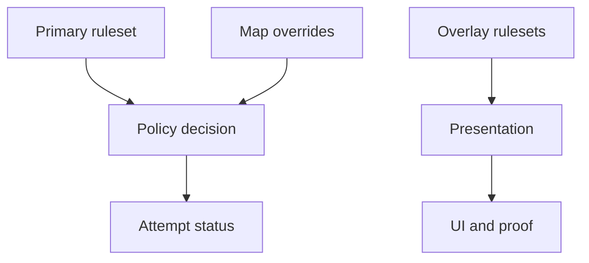

Rulesets define Akron's policy environment. They decide whether feature use is allowed, blocked, recorded, or presented differently.

This is reference material. Normal player guides should start with the Akron overlay, visible attempt status, and setup packs. Primary rulesets are available through Akron's Everest mod options, debug/automation commands, and imported ruleset data; they are not the main overlay navigation model.

## Built-In Primary Rulesets

| Ruleset | Purpose |
|---|---|
| `Casual` | General play with a broad set of clean and utility surfaces. |
| `Practice` | Room-lab ruleset for StartPos, HUD review, and routing workflows. |
| `Leaderboard-clean` | Stricter clean-play guardrails for submitted attempts. |
| `Sandbox` | Local unrestricted experiments. |
| `Everest-safe` | Conservative compatibility-oriented policy. |
| `Map-maker` | Map inspection, capture, and creator-oriented workflows. |

## Overlay Rulesets

| Overlay state | Purpose |
|---|---|
| `Streamer Mode` | User-facing toggle that hides local filesystem paths in Akron-owned UI and proof output. |
| `Proof-mode` | Proof presentation state enabled by Submission Mode or community rulesets. It is not a standalone first-class player toggle. |
| `Low-distraction` | Derived state when visual-noise channels are configured for lower distraction. It is not selected directly. |

## Ruleset Stack

Primary rulesets control allowed behavior. Overlay states change presentation or proof output and may be shown in the current stack. Map compatibility overrides can affect risky runtime paths such as StartPos restore.

## Reading A Ruleset

For each feature, ask:

1. Is the feature allowed in this ruleset?
2. If allowed, what status does it record?
3. Does any suboption have stricter behavior?
4. Does a map compatibility override change the runtime path?
5. Does an overlay state hide paths or add proof output?

Use [Feature status reference](/reference/feature-status-reference) for the current feature classifications.
